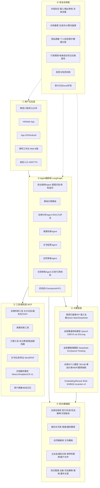
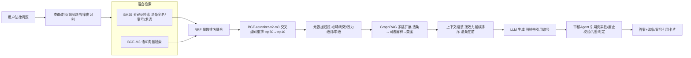
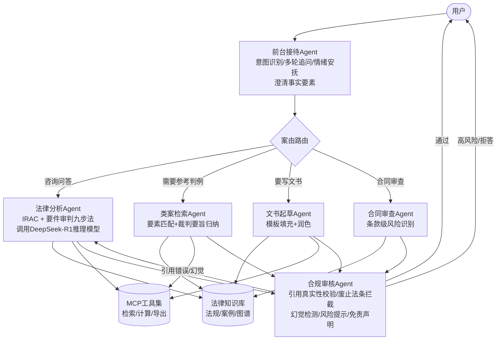
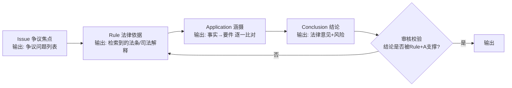

# 法律AI智能体技术架构调研方案（C端法律咨询+文书生成 → B端律师工具）

> 调研时间：2026-09｜定位：架构调研阶段可落地方案｜面向中国市场
> 核心立场：**不做自研基座大模型，走"开源底座（DeepSeek/Qwen）法律领域后训练 + 强工程化RAG + LangGraph多Agent编排"路线**，通用能力优先复用已备案商用API，自建部分聚焦法律垂直数据与工具链。

---

## 核心发现与推荐方案（摘要）

1. **模型路线明确推荐 (b)+(c) 混合**：以 DeepSeek-V3/R1 或 Qwen3 系列开源底座做法律领域 SFT+RL（GRPO），不碰自研基座；通用对话/简单问答直接调用已备案商用API（通义法睿/Qwen-Max/DeepSeek官方API），复杂法律推理走自部署开源推理模型。理由：2025-2026年DeepSeek-V3/R1、Qwen3-235B在中文与推理基准上已逼近闭源旗舰，自研基座需万卡级算力与十亿级token语料，创业者阶段ROI为负。
2. **Harvey 路线已被验证但不适合直接照搬**：Harvey 早期基于 OpenAI 定制微调（10B tokens法律语料+Voyage法律embedding），2026年8月发布首个自有模型 Harvey Tenet，**改用月之暗面 Kimi K3 作为底座做后训练**——这恰恰证明"强开源底座+领域后训练"是全球头部法律AI的收敛路线，而非自研基座。
3. **通义法睿是最佳参照系**：以Qwen为基座，1.6亿份裁判文书+全量法规预训练，叠加模型精调、RL、RAG、法律Agent、司法小模型五层技术，采用 Agentic+Iterative Planning 架构。创业者应把它当作"能力上限对标"而非竞品，走差异化（C端口语化咨询、垂类细分案由、更低价格）。
4. **RAG 是法律AI的生命线，不是可选项**：法律场景对"每条结论可溯源到具体法条/案号"是硬要求。必须做 **BM25关键词 + BGE-M3向量双路检索 → RRF融合 → BGE-reranker重排 → 引用强制对齐**，缺任一环幻觉率都不可接受。
5. **分块必须按法律结构切，禁止固定字符切分**：法条按"编→章→节→条→款→项→目"层级切，合同按"条款（clause）"切，裁判文书按"本院查明/本院认为/判决如下"切；chunk 1024-1536 tokens，overlap 10-15%，并在每个chunk前注入文档级摘要（Summary-Augmented Chunking）。
6. **Embedding 推荐 BGE-M3（稠密+稀疏一体）**，搭配 BGE-reranker-v2-m3 做交叉编码器重排；有条件时在自有法律问答对上继续微调embedding（Harvey做法：与Voyage联合训练 voyage-law-2，无关检索降低25%）。
7. **编排框架推荐 LangGraph（核心生产链路）+ Dify（内部工具/快速POC）**：LangGraph 提供有状态图、checkpoint、human-in-the-loop、 durable execution，是2025-2026复杂Agent生产标准；Dify 用于运营同学快速搭知识库问答。Coze 不建议用于核心链路（数据出境/定制化受限）。
8. **多Agent拓扑推荐"1前台 + 4专业 + 1审核"**：前台接待（意图识别/多轮追问）→ 案由分类 → 法律分析（IRAC/九步法）→ 类案检索 → 文书起草 → 合规审核（幻觉检测/引用校验/风险提示）。审核Agent是法律AI区别于普通Chatbot的关键。
9. **法律推理工程化 = IRAC × 要件审判九步法 固化为工作流节点**：不要指望模型自己"像律师一样思考"，要把 Issue→Rule→Application→Conclusion 拆成显式节点，每步强制产出结构化JSON，审核节点校验"结论是否被Rule+Application支撑"。
10. **推理模型（DeepSeek-R1类）用于"分析"而非"对话"**：R1类长CoT模型慢且贵，适合放在"法律分析Agent"做要件拆解与类案比对；C端首轮对话、文书模板填充用V3/Qwen3这类快模型，按任务路由不同模型，是Harvey"多模型组合、单次查询调用数十次小模型"的核心省钱逻辑。
11. **向量库推荐 Qdrant（10M-5000万向量主力）+ PostgreSQL/pgvector（ metadata/小数据）**：Milvus留给十亿级且有专门运维团队时再上；ES/BM25负责关键词路。Qdrant 原生支持稠密+稀疏混合向量与payload过滤，RPS在同类中领先。
12. **推理部署推荐 SGLang（DeepSeek/Qwen3/Agent树搜索场景）为主，vLLM兜底**：SGLang 的 RadixAttention 对共享前缀的Agent循环、结构化输出、DeepSeek MLA kernel 优化明显，H100上吞吐较vLLM高约29%；vLLM 生态更通用，适合batch与冷启动。
13. **合规是生死线，不是收尾工作**：面向中国公众提供生成式AI服务，**调用已备案商用API走地方网信办登记即可**（最轻）；若自部署开源模型对外提供服务，需完成国家网信办生成式AI备案+算法备案+安全评估，周期3-6个月。C端法律咨询还需叠加"非诉讼代理、结果仅供参考、紧急情况报警/找律师"强 disclaimer 与内容安全过滤。
14. **法律幻觉用"三道闸门"控制**：检索闸门（无相关法条/案例→拒答或声明"现行法未明确"）→ 生成闸门（prompt强制"只能基于给定法条作答，禁止虚构案号"）→ 审核闸门（Verifier Agent逐条核对引用是否真实存在、是否被废止/修订）。
15. **长合同处理用"条款级RAG + 长上下文兜底"，不是二选一**：50页以内合同走 Qwen3-Long/GLM-4-Long 长上下文（128K-1M）直接全量喂入做条款审查；超长合同（>200页/百兆卷宗）走条款级chunking+RAG，再把命中条款拼成上下文。

---

## 1. 整体技术分层架构

### 1.1 六层架构总览

### 1.2 各层组件清单

| 层 | 核心组件 | 说明 |
|---|---|---|
| 用户交互层 | 小程序/H5/App/律师工作台/语音 | C端先做小程序+公众号（获客成本最低），B端律师工作台后期；语音入口用ASR( Paraformer/SenseVoice)+TTS(CosyVoice) |
| Agent编排层 | LangGraph状态机、意图路由、多Agent协作、Checkpoint、Human-in-the-loop | 所有流程显式图化，支持断点续跑、人工介入审核文书 |
| 大模型层 | 商用API+自部署开源模型分级路由+法律小模型+Embedding/Rerank | 按任务难度/成本路由，不把所有请求都打给最贵模型 |
| 知识/数据层 | 法规库/案例库/模板库/私域库/知识图谱 | 法规库必须带"时效性版本"（生效/废止/修订日期） |
| 工具/服务层 | MCP标准化工具集 | 检索、计算、文书导出、文档解析全部MCP Server化，可被任意Agent复用 |
| 安全合规层 | 内容审核、备案、脱敏、溯源、拒答、审计eval | 贯穿全链路，独立于业务 |

---

## 2. 法律垂直大模型路线选型

### 2.1 三条路线对比

| 维度 | (a) 自研基座大模型 | (b) 开源底座法律后训练 | (c) 通用API + RAG工程 |
|---|---|---|---|
| **初始算力成本** | 极高（千~万张H卡，数亿元级） | 中（8-64张H卡/A100做SFT+RL，数十万~数百万元） | 极低（无GPU或少量embedding GPU） |
| **数据需求** | 千亿~万亿token通用+法律语料 | 百万~千万token法律高质量问答对/CoT（如Unilaw-R1用1.7万条CoT） | 仅需知识库文档，无需训练数据 |
| **法律术语/风格** | 最强但不显著优于(b) | 强，可习得法律推理范式与文书风格 | 依赖通用模型，法律语感偏弱 |
| **知识时效性** | 差（重训周期长） | 中（靠RAG补时效） | 最好（RAG动态更新，无需重训） |
| **技术门槛** | 极高（需大模型预训练团队） | 中（需SFT/RL infra，可用LLaMA-Factory/TRL） | 低（工程为主） |
| **迭代速度** | 月/季度级 | 周级（数据集更新后重训LoRA） | 天级（改prompt/知识库即可） |
| **合规备案** | 必须亲自备案，责任重 | 必须亲自备案（自部署对外服务） | **调用已备案API，仅需地方网信办登记，最轻** |
| **数据主权** | 完全自有 | 完全自有（可私有化部署给律所） | 数据出域给API方，B端律所难接受 |
| **效果上限** | 最高 | 高（2026年开源底座已接近闭源） | 中高（受限于底座，但RAG补知识） |
| **代表玩家** | 早期Harvey(OpenAI定制)/GPT-4自定义训练 | 通义法睿(Qwen基座)、DeepLegal-CN(DeepSeek)、Harvey Tenet(Kimi K3基座)、Unilaw-R1 | 大量法律创业公司初期 |

### 2.2 明确推荐：(b)+(c) 组合，分三阶段演进

**阶段一（0-6个月，MVP）：路线(c)为主**
- 底座直接调用**已备案商用API**：通义法睿（法律专精）+ DeepSeek-V3/Qwen-Max（通用兜底）。
- 全部精力投入RAG工程、Agent编排、C端体验。
- 合规最轻：调用已备案模型，做地方网信办登记即可。
- 理由：创业者要先验证PMF，不要在模型上烧钱。

**阶段二（6-18个月，差异化）：叠加路线(b)**
- 选 **DeepSeek-V3.2 / Qwen3-32B（或其MoE版）** 作为自部署底座，做：
  - 继续预训练：法律语料（法规、裁判文书、教材）10-50B tokens；
  - SFT：1-5万条高质量法律问答/文书/IRAC推理样本；
  - RL（GRPO）：用"是否引用正确法条/是否通过审核Agent"作为奖励信号，参考 Unilaw-R1 / DeepSeek-R1 蒸馏路线。
- 训练法律小模型（7B/14B）做案由分类、要素抽取、量刑情节识别——这些高频任务用小模型省钱。
- 自部署后需**自己完成生成式AI备案**，B端私有化客户也才能接受。

**阶段三（18个月+，B端护城河）：领域embedding + 私有微调**
- 联合/自研法律领域embedding（BGE-M3基础上用法律问答对继续训练）。
- 为头部律所做客户专属LoRA（模板/风格/内部先例），参考Harvey的"firm customization layer"。

**不推荐自研基座(a)**：2025-2026年开源模型能力外溢极快（Qwen3-235B已对标o1/R1，DeepSeek-V3.2/MoE效率极高），自研基座在效果上已无代差优势，成本却高两个数量级。Harvey 2026年放弃纯OpenAI路线、转用Kimi K3开源底座做后训练，已是行业风向标。

---

## 3. 法律场景 RAG 完整方案

### 3.1 端到端 RAG 流程

### 3.2 数据摄入与文档解析

| 文档类型 | 解析方案 | 关键点 |
|---|---|---|
| 法条/司法解释（结构化文本） | 直接结构化入库，按 编/章/节/条/款/项/目 解析为树 | 必须带：发布机关、文号、生效日期、废止日期、效力级别（法律/行政法规/地方性法规/司法解释/部门规章） |
| 裁判文书PDF | **MinerU 2.6+** 或 **PaddleOCR-VL 1.5** | 处理扫描件、印章、版式；PaddleOCR-VL 1.5 原生支持印章识别与异形框，OmniDocBench 94.5% |
| 合同PDF/Word | MinerU 版面分析 → 条款级抽取 | 保留条款编号（第X条）作为切分锚点，禁止按固定字数切 |
| 证据图片/手写笔录 | PaddleOCR-VL + 手写体识别 | 单独走OCR管线，结果结构化入证据库 |
| 表格（赔偿计算表/利率表） | PP-StructureV3 / MinerU表格抽取 | 表格转Markdown/HTML保留结构 |

### 3.3 分块（Chunking）策略

| 知识库 | 切分策略 | chunk大小 | overlap |
|---|---|---|---|
| 法律法规 | 按"条"为最小单元，一条一款；过长条文再按款切；注入 法律名称+章节路径 作为上下文前缀 | 512-1024 tokens | 0（条内不重叠，跨条不切分） |
| 裁判文书 | 按"本院查明/本院认为/判决主文"等结构段切 | 1024-1536 tokens | 10-15% |
| 合同 | **条款级（clause-level）切分**，以"第X条"为锚点 | 512-1024 tokens | 0 |
| 教材/论文 | 语义层级切分+文档级摘要前置（SAC: Summary-Augmented Chunking） | 1024 tokens | 200 tokens |

**关键工程点**：
- 每个chunk必须携带 metadata：`{法规名, 条文号, 生效日期, 废止日期, 地域, 案由, 审级, 文书ID}`，供后续过滤。
- 采用 SAC（Summary-Augmented Chunking）：在每个chunk前加一段文档级摘要，检索召回率显著提升；研究表明通用摘要比专家标注摘要更鲁棒。
- 合同审查场景**条款级切分是胜负手**——固定500字切分一个免责条款会被切成三块，检索回来全是碎片。

### 3.4 Embedding / Rerank 选型

| 组件 | 推荐 | 理由 |
|---|---|---|
| Embedding | **BGE-M3**（智源） | 单模型同时输出稠密+稀疏+多向量，支持8192上下文，中文法律表现强，开源可私有化 |
| 领域Embedding（进阶） | BGE-M3 基础上用自有法律问答对继续微调 | Harvey用Voyage法律embedding使无关检索降25%；创业者数据积累后必做 |
| Rerank | **BGE-reranker-v2-m3**（cross-encoder） | 对[query, chunk]对联合打分，捕捉向量余弦漏掉的细粒度相关；top50重排到top10 |
| 向量+关键词融合 | **RRF（Reciprocal Rank Fusion）** | 无需对齐余弦分与BM25分尺度，工业界标准做法 |

### 3.5 查询改写与多跳检索

- **查询改写**：用户口语"我被老板炒了能要多少钱" → 改写成"违法解除劳动合同 赔偿金 N+1 2N 计算标准"。用小模型做query rewriting + 案由识别。
- **HyDE**：让LLM先生成假设性答案，用假设答案去做向量检索，提升口语化query召回。
- **多跳（GraphRAG）**：命中"《民法典》第577条违约责任"后，沿图谱自动扩展：相关司法解释→指导案例→关联请求权基础。

### 3.6 引用溯源与幻觉控制

- **强制引用格式**：prompt要求生成时每条主张标注 `[1][2]`，对应上下文里的法条/案号；前端渲染为可点击引用卡片（法条名+条款号+生效日期）。
- **三道闸门**：
  1. **检索闸门**：rerank最高分低于阈值 → 不硬答，回复"经检索，现行法律对此问题无明确规定，建议咨询律师"。
  2. **生成闸门**：system prompt写死"只能基于以下参考法条作答，禁止虚构案号、法条号；不确定就说不确定"。
  3. **审核闸门**：Verifier Agent 把生成的引用逐条回库校验——该法条是否真实存在？是否已被废止/修订？引用条文号与内容是否匹配？不通过则拦截重生成。

### 3.7 进阶：GraphRAG / Agentic RAG

- **法律知识图谱节点**：法规、条文、司法解释、案例、案由、要件（如"过错""因果关系""损失数额"）、地域。
- **边**：`引用(cites)`、`修订于(amended_by)`、`废止(replaced_by)`、`适用(applies_to案由)`、`例外(exception)`、`构成要件(element_of)`。
- **价值**：解决"小差别导致完全不同判决"的问题（如成年人vs未成年人、是否入户抢劫），纯向量检索无法捕捉这种条件依赖。LegalGraphRAG 等2025-2026论文已验证多Agent图检索在法律推理上的可靠性。
- **落地建议**：MVP阶段先用向量+关键词；**6个月后**再建轻量图谱（先做"法条↔司法解释↔指导性案例"三角关系，不要一上来做全量实体图谱）。

---

## 4. Agent 能力设计与工具链

### 4.1 核心工具集（MCP Server 化）

| 工具 | 输入 | 输出 | 说明 |
|---|---|---|---|
| 案由分类器 | 案情描述 | 案由标签+管辖法院层级 | 小模型7B即可，准确率>90% |
| 法律要素抽取 | 案情描述 | 结构化JSON（时间/金额/主体/过错/证据） | NER+信息抽取 |
| 要件分析器 | 案由+案情 | 构成要件清单+待证事实清单 | IRAC/九步法实现 |
| 证据清单生成 | 要件缺口 | 应收集证据清单 | 告诉用户"你还需要什么证据" |
| 法条检索 | 法律问题 | 相关法条列表 | RAG封装 |
| 类案检索 | 案情要素 | 相似案例top10+裁判要旨 | 基于要素相似度而非纯文本 |
| 文书起草 | 案情+要素 | 起诉状/答辩状/合同/律师函 | 模板填充+LLM润色 |
| 合同审查 | 合同文本 | 风险点清单+修改建议 | 条款级RAG+红线标注 |
| 赔偿/刑期预测 | 案情要素 | 区间预测+依据 | 回归模型+类案统计，**必须给区间而非点估，并免责** |
| 计算器 | 金额/天数 | 诉讼费/利息/违约金 | 确定性工具，不靠LLM算 |
| 文书导出 | 结构化文书 | Word/PDF | 模板引擎(python-docx) |

### 4.2 Function Calling / MCP / ReAct 工程实践

- **协议**：工具全部用 **MCP（Model Context Protocol）** 封装（Anthropic 2024.11提出，2025.12捐赠Linux基金会，2026年初已有1万+ MCP Server）。MCP 作为Agent与工具间的"USB-C"，工具一次开发可被任何支持MCP的客户端（Claude/自研Agent/LangGraph）复用。
- **范式**：复杂推理用 **ReAct**（Thought→Action→Observation循环），但**必须限制最大步数（如≤15步）防止死循环**；结构化任务（合同审查、文书起草）优先用**固定工作流**而非自由ReAct，确定性更高。
- **Function Calling**：底座模型需支持原生function calling（Qwen3/DeepSeek-V3/GPT级都支持），工具描述写清楚输入schema与示例，避免模型瞎调。
- **路由原则**：能确定性计算的（诉讼费/利息）走代码工具，绝不让LLM算；能模板化的（标准起诉状）走模板，LLM只填空。

---

## 5. 多 Agent 协作架构

### 5.1 推荐拓扑：1前台 + 4专业 + 1审核

### 5.2 各Agent职责

| Agent | 职责 | 模型 | 备注 |
|---|---|---|---|
| 前台接待 | 听懂口语、追问缺失事实（时间/金额/过错）、判断是否紧急（家暴/刑事→建议立即报警/找律师） | 快模型 Qwen3-32B | 不直接给法律结论，只做信息收集与分流 |
| 法律分析 | 走IRAC/九步法，产出结构化法律意见 | 推理模型 R1/Qwen3-Thinking | 慢但深，是核心价值 |
| 类案检索 | 按要素检索相似案例、归纳裁判尺度 | 快模型+向量检索 | 输出带案号的案例列表 |
| 文书起草 | 基于模板生成起诉状/答辩状/律师函 | 快模型 | 人工可编辑 |
| 合同审查 | 逐条风险标注 | 长上下文模型 | 条款级 |
| **合规审核** | **所有产出必经此关**：核对引用、拦截废止法条、检测幻觉、加免责声明 | 快模型+规则引擎 | 法律AI的"质检部门"，独立于业务Agent |

**为什么需要审核Agent独立**：法律错误的代价远高于普通问答。Harvey把"citation engine"做成独立子系统；Falkor-IRAC 用图约束生成——LLM提案后Verifier检查图谱中是否存在支持路径，无路径则拒绝输出。这是法律AI可信度的关键。

---

## 6. 法律推理能力工程化

### 6.1 IRAC → 显式工作流节点

不要让模型一次性"自由发挥"，把IRAC四步拆成LangGraph节点，每步产出结构化JSON：

工程要点：
- **Issue节点**：从案情中提取争议焦点（如"是否构成根本违约""违约金是否过高"）。
- **Rule节点**：必须走RAG检索，禁止模型凭记忆写法条号。
- **Application节点**：强制做"要件→事实"映射表，缺哪个要件就提示用户补证据。
- **Conclusion节点**：只能基于前两步产出，不确定时输出"需进一步证据/存在裁量空间"。

### 6.2 邹碧华"要件审判九步法"映射

| 九步法步骤 | Agent节点动作 |
|---|---|
| 1. 固定权利请求 | 前台接待确认用户想要什么结果（赔偿/离婚/解除合同） |
| 2. 识别请求权基础 | 法律分析Agent检索支持该请求的法条（如《民法典》第577条） |
| 3. 识别抗辩权基础 | 检索对方可能援引的抗辩（诉讼时效/不可抗力/过错相抵） |
| 4. 基础规范分解 | 把法条拆成构成要件（如违约=合同有效+有违约行为+无免责事由） |
| 5. 规范要件事实化 | 每个要件对应需要证明的事实 |
| 6. 诉讼主张证明 | 类案检索Agent提供类似事实的认定 |
| 7. 事实证明 | 证据清单Agent列出待收集证据 |
| 8. 要件归入 | Application节点：把已查明事实归入要件 |
| 9. 裁判结论 | Conclusion节点 |

落地：把九步法写成 LangGraph 的固定节点序列，每个节点对应一个prompt模板+工具调用，这比"让模型像律师一样思考"可靠得多。

---

## 7. 多模态能力方案

| 能力 | 方案 | 说明 |
|---|---|---|
| 合同/证据图片OCR | **PaddleOCR-VL 1.5**（开源可私有化）或阿里云/百度OCR API | 原生支持印章识别、扫描件、手写体、表格；PaddleOCR 3.0+ 国产硬件适配 |
| 扫描PDF解析 | **MinerU 2.6+** | 面向Agent/RAG的文档解析，输出结构化Markdown，支持版面/表格/公式，兼容MCP |
| 语音咨询（ASR） | FunASR / **SenseVoice**（阿里开源，中文强） | C端语音入口，方言可配 |
| 语音合成（TTS） | **CosyVoice**（阿里开源） | 法律播报，普通话为主 |
| 庭审录像理解（远期B端） | 视频抽帧(Qwen2.5-VL/GLM-4V)+语音转写+分段摘要 | MVP不做，B端律师产品二期 |

**建议**：C端MVP先做文字；语音作为差异化在v1.1上线；庭审理解属于B端重资产，放到后期。

---

## 8. 关键技术难点与解法

| 难点 | 解法 |
|---|---|
| **法律幻觉** | 三道闸门（检索阈值拒答+prompt约束+Verifier逐条核对引用）；废止法条黑名单；不确定就说不确定 |
| **地方性法规/地域差异** | 法规库metadata带"地域"字段，前台接待必须追问"事发/被告在哪个省市"，检索时地域过滤；提示"各地裁判尺度存在差异" |
| **新法/司法解释时效** | 法规库每日爬取全国人大/最高法/地方政府新规，版本化存储（生效/废止日期）；RAG检索时**只取现行有效版本**，历史版本仅作参考 |
| **类案匹配精度** | 不纯靠文本向量，做**要素级匹配**（案由+关键词+情节标签结构化检索+向量语义融合）；量刑情节单独建模 |
| **结果可解释性** | 每条结论必带"依据：法条+案号+理由"；IRAC中间过程对用户可见；不做黑盒判决预测 |
| **长合同处理** | ≤50页走长上下文（Qwen3-Long/GLM-4-Long，128K+）全量审查；>200页走条款级RAG，命中条款拼上下文；两者结合 |
| **咨询责任边界** | 全程 disclaimer："本回答仅供参考，不构成法律意见，紧急情况请拨打110/12348或委托律师"；不直接给"你一定能赢"的承诺；刑事案件引导找辩护人 |
| **冷启动数据** | 先用公开裁判文书+法规做知识库；用LLM蒸馏生成CoT样本（参考Legal-R1从DeepSeek-R1蒸馏）；上线后用真实对话+律师反馈做RLHF |

---

## 9. 具体技术栈推荐

### 9.1 推荐技术栈组合表

| 类别 | 候选方案 | **推荐** | 理由 |
|---|---|---|---|
| **Agent编排框架** | LangGraph / LlamaIndex / Dify / Coze / AutoGen(AG2) / 自研 | **LangGraph（核心生产）+ Dify（内部POC/运营）** | LangGraph是2025-2026复杂有状态Agent生产标准：显式图、checkpoint、durable execution、HITL，IDC实测256节点P99延迟270ms；Dify降低运营同学门槛；Coze不用于核心（数据/定制受限）；AutoGen偏向研究 |
| **底座模型（自部署）** | DeepSeek-V3.2/R1 / Qwen3 / GLM-4 / Llama | **DeepSeek-V3.2(快)+DeepSeek-R1(推理) 主力，Qwen3备选** | 中文法律语境、开源协议友好、SGLang深度优化；Qwen3生态同样成熟，可双跑做A/B |
| **商用API** | 通义法睿 / DeepSeek官方 / Qwen-Max / GPT-4o | **通义法睿（法律专精）+ DeepSeek API（通用兜底）** | 通义法睿已备案、法律能力原生；MVP阶段合规最轻 |
| **法律小模型** | 自训7B/14B | **基于Qwen3-4B/8B LoRA微调** | 案由分类/要素抽取/NER高频任务，省钱 |
| **Embedding** | BGE-M3 / text-embedding-3 / 自行微调 | **BGE-M3** | 稠密+稀疏一体，中文强，开源可私有化 |
| **Rerank** | BGE-reranker-v2-m3 / Cohere Rerank | **BGE-reranker-v2-m3** | 开源、效果好、可私有化 |
| **向量数据库** | Milvus / Qdrant / PGVector / ES | **Qdrant（主力）+ PostgreSQL/pgvector（轻量metadata）** | Qdrant 1.10原生稠密+稀疏混合、payload过滤强、RPS领先，适合1000万-5亿向量；PGVector适合元数据/小数据；Milvus留到十亿级且有运维团队 |
| **关键词检索** | Elasticsearch / OpenSearch | **Elasticsearch (BM25)** | 与Qdrant双路，RRF融合 |
| **图数据库** | Neo4j / FalkorDB / NebulaGraph | **Neo4j（成熟）或 FalkorDB（图+向量快）** | GraphRAG二期，先做轻量法条关系网 |
| **推理引擎** | vLLM / SGLang / TensorRT-LLM | **SGLang（DeepSeek/Qwen3/Agent场景）+ vLLM兜底** | SGLang RadixAttention对Agent共享前缀、结构化输出、DeepSeek MLA优化显著，H100吞吐领先约29%；vLLM生态通用、batch友好 |
| **文档解析** | MinerU / PaddleOCR-VL / PP-StructureV3 | **MinerU（PDF/合同）+ PaddleOCR-VL 1.5（扫描件/印章）** | 法律文档版式复杂，两者互补；均开源可私有化 |
| **语音** | SenseVoice / FunASR / CosyVoice | **SenseVoice(ASR)+CosyVoice(TTS)** | 中文语音，开源可私有化 |
| **可观测/评测** | LangSmith / Langfuse / RAGAS | **Langfuse（开源自托管）+ RAGAS** | 法律AI必须做eval：引用准确率、忠实度、拒答率 |
| **备案合规** | 网信办备案 | **MVP调已备案API→地方登记；自部署后做国家备案** | 见§合规 |

### 9.2 推荐组合一句话总结

> **前端小程序/H5 → LangGraph多Agent编排 → 模型按任务路由（前台/文书用Qwen3-32B快模型，法律分析用DeepSeek-R1推理模型，MVP先走通义法睿/DeepSeek API）→ RAG走 BGE-M3向量 + ES/BM25关键词 → RRF融合 → BGE-reranker重排 → Qdrant+PostgreSQL存储 → MinerU/PaddleOCR-VL解析 → SGLang/vLLM自部署 → Langfuse评测 + 独立合规审核Agent把关。**

---

## 参考来源

1. Harvey 官方博客 — *Integrating Deep Research into Harvey*（2025-07）https://www.harvey.ai/blog/integrating-deep-research-into-harvey
2. Harvey Help — *What AI Models Does Harvey Use?*（2026-07）https://help.harvey.ai/articles/what-ai-models-does-harvey-use
3. DEV Community — *Opus+RAG vs Fine-tuned LLM+RAG: LEX vs Harvey*（2026-07）https://dev.to/overthelex/opus-rag-vs-fine-tuned-llm-rag-two-approaches-to-legal-ai-lex-vs-harvey-19b
4. 腾讯新闻 — *企业主权AI：Harvey如何把核心法律智能建立在中国开源模型之上（Harvey Tenet/Kimi K3）*（2026-08）http://news.qq.com/rain/a/20260822A0BAF200
5. ZenML — *Scaling Agent-Based Architecture for Legal AI Assistant*（2026）https://www.zenml.io/llmops-database/scaling-agent-based-architecture-for-legal-ai-assistant
6. 阿里云百炼 — *通义法睿产品介绍*（2026-09）https://help.aliyun.com/zh/model-studio/tongyi-farui
7. 阿里云 — *farui-plus 模型能力*（2026-09）https://help.aliyun.com/en/model-studio/farui-plus
8. CSDN — *通义法睿 Agentic+Iterative Planning 架构解析*（2025-12）https://blog.csdn.net/Peter_Changyb/article/details/156110232
9. arXiv — *Unilaw-R1: Legal Reasoning with RL and Iterative Inference*（2025-10）https://arxiv.org/html/2510.10072v1
10. arXiv — *Towards Reliable Retrieval in RAG for Large Legal Datasets（SAC分块）*（2025-10）https://arxiv.org/html/2510.06999
11. arXiv — *LegalGraphRAG: Multi-Agent Graph RAG for Reliable Legal Reasoning*（2026）https://arxiv.org/html/2605.28120v1
12. arXiv — *Ontology-Driven Graph RAG for Legal Norms（法条版本/时效建模）*（2025）https://arxiv.org/html/2505.00039v4
13. arXiv — *Benchmarking Multi-Step Legal Reasoning / IRAC（MSLR数据集）*（2025-11）https://arxiv.org/html/2511.07979v3
14. arXiv — *Falkor-IRAC: Graph-Constrained Generation for Verified Legal Reasoning*（2026）https://arxiv.org/pdf/2605.14665v2
15. Qwen官方博客 — *Qwen3: 思深行速*（2025-04）https://qwenlm.github.io/zh/blog/qwen3/
16. Cognaptus — *When RAG Meets the Law: Trustworthy Legal AI（多模型fallback）*（2025-11）https://cognaptus.com/blog/2025-11-06-when-rag-meets-the-law-building-trustworthy-legal-ai-for-a-moving-target/
17. MinerU 官方 — *面向Agent和RAG的智能文档解析平台*（2026）https://mineru.net/
18. PaddleOCR官方 — *PaddleOCR-VL 1.5 印章识别/异形框*（2026）https://www.paddleocr.ai/latest/version3.x/pipeline_usage/PaddleOCR-VL.html
19. 国家网信办 — *2025年生成式人工智能服务已备案信息公告*（2026-01）https://www.cac.gov.cn/2026-01/09/c_1769688009588554.htm
20. 新华网 — *611款生成式AI服务完成备案*（2025-11）http://www.news.cn/tech/20251113/47b808549fdd4bc080d646b5c0e8e611/c.html
21. Inductivee — *Vector Database Comparison & Benchmarks 2025（Qdrant/Milvus/pgvector）*（2026-04）https://inductivee.com/blog/vector-database-performance-benchmarks-2025
22. LocalAIMaster — *SGLang vs vLLM 完整对比（DeepSeek/Agent场景）*（2026-08）https://localaimaster.com/blog/sglang-vs-vllm-comparison
23. arXiv — *Bridging Protocol and Production: MCP Design Patterns*（2026）https://arxiv.org/pdf/2603.13417
24. JavaGuide — *什么是MCP？与Function Calling/Agent的关系*（2026-08）https://javaguide.cn/ai/agent/mcp.html
25. Future AGI — *How to Build and Evaluate a Contract Review RAG Agent in 2026（条款级分块）*（2026-05）https://futureagi.com/blog/contract-review-rag-build-evaluate-2026/
