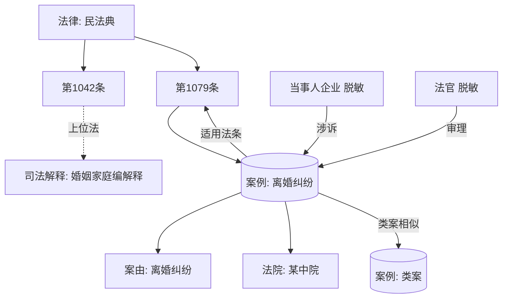

# 中国法律 AI 智能体数据体系调研报告

> 调研对象：面向中国市场的全面法律 AI 智能体（"背靠庞大数据支撑"）
> 调研阶段：架构调研
> 调研时间：2026 年 9 月
> 数据口径：优先采用 2024–2026 年官方发布、开源项目主页与权威报道

---

## 核心发现（摘要）

1. **中国法律"核心成文法"体量其实不大，但"衍生数据"极庞大。** 现行有效法律仅约 311 件、行政法规/监察法规 600 余件、地方性法规 1.4 万余件、司法解释约 560 件；真正撑起"数据厚度"的是累计过亿份裁判文书、38 万余件各级规范性文件、以及 1.3 亿级的商业案例库收录量。
2. **裁判文书网已不能再作为"批量数据主源"。** 年上网量从 2020 年峰值 1920 万件降至 2022 年 1040 万件、2023 年约 511 万件；2024–2025 年回升至 969 万、1097.9 万份，但反爬严格、上网范围收窄、法官/当事人信息进一步隐名，**全量爬取既不现实也不合规**。
3. **官方权威类案入口已切换到"人民法院案例库"（rmfyalk.court.gov.cn）。** 2024 年 2 月上线，首批 3711 件，2025 年 7 月突破 5000 件，2026 年工作报告披露已达 5300 余件，实现常见罪名/案由全覆盖。这是产品"类案检索"功能最该对标、最该合规采购/接入的高质量小而精数据源。
4. **"免费官方 + 商业采购 + 开源数据集"三层组合是唯一可行策略。** 法条/司法解释走国家法律法规数据库（flk.npc.gov.cn）和各省政府规章库；案例深度数据走北大法宝/威科/Alpha/聚法等商业授权；模型微调冷启动走 CAIL2018、DISC-Law-SFT、夫子·明察、HanFei、LexiLaw 等开源数据。
5. **合规红线在于"已公开个人信息的合理使用边界"。** 最高法入库参考案例"麦某波案"明确：对已公开裁判文书中的当事人信息进行筛选、加工、评价并商业化，超出"合理范围"即构成侵犯个人信息权益；**产品必须做脱敏 + 禁止当事人画像/人肉检索 + 留存合规日志**。
6. **著作权上，法条/裁判文书本身不宜主张强版权，但"数据库编排"受保护。** 单纯法条原文、裁判要旨可合理引用；但商业库的结构化标注（法条关联、裁判标准、标签体系）受著作权和反不正当竞争保护，**直接镜像商业库 = 高危**。
7. **知识图谱是法律 RAG 的胜负手。** 法律文本天然层级化（法律→编→章→节→条→款→项）且强交叉引用，纯向量检索召回不准；建议 Neo4j 存"法条层级 + 引用 + 类案 + 上下级法院"关系，向量库存语义块，ES 存全文关键词，MySQL/PG 存结构化字段，数据湖存原始 PDF/HTML。
8. **企业/信用/执行数据必须走付费 API，不要爬。** 企查查/天眼查/启信宝工商照面 API 已标准化（0.1–1 元/次，套餐千元级/万次），执行信息公开网失信主体实时约 874 万个，爬取成本与法律风险远高于采购。
9. **合成数据 + 专家标注是差异化关键。** 开源 SFT 数据（约 30 万条级别）只能做底座冷启动；产品竞争力来自法律专家标注的"要件抽取、三段论判决、类案比对、合同审查"高质量指令数据，以及 LLM 合成 + 专家审核的工作流。
10. **更新流水线必须"事件驱动"。** 新法/司法解释发布、案例库新增参考案例、指导性案例更新，需要每日监听 flk.npc.gov.cn、court.gov.cn、rmfyalk.court.gov.cn、12309.gov.cn，触发法条版本比对、图谱边重建、向量重嵌。
11. **检察文书公开规模有限但权威性强。** 12309 中国检察网公开起诉书/不起诉决定书/抗诉书，商业库（北大法宝）称收录检察文书 700 万篇量级；适合刑事业务线，不适合作为通用语料主源。
12. **总体建议：MVP 阶段不要追求"全量爬虫"，而要追求"权威小数据 + 合规授权 + 高质量标注"。** 把预算花在人民法院案例库接入、北大法宝/威科授权、企业 API、脱敏流水线和法律专家标注上，比爬一个随时可能被封的裁判文书网 ROI 高一个数量级。

---

## 一、法律数据源全景图

### 1.1 数据源全景表

| 大类 | 数据源 | 主要内容 | 获取方式 | 成本 | 合规风险 |
|---|---|---|---|---|---|
| 成文法 | 国家法律法规数据库 flk.npc.gov.cn（全国人大） | 宪法、法律约 311 件、行政法规 605 件、监察法规 2 件、司法解释 560 件、地方性法规约 1.58 万件 | 官方免费浏览/下载，无公开 API，可合规镜像 | 免费（人工/脚本采集） | 低（官方公开）；注意版本时效性 |
| 成文法 | 31 省级法规规章规范性文件数据库 | 截至 2024 年 11 月共收录 38 万余件（地方性法规 21158 件、地方政府规章 10920 件、人大决议 19308 件、行政规范性文件 32.78 万件） | 各省人大官网免费公开 | 免费 | 低；地方红头文件格式不统一，需清洗 |
| 成文法 | 中国政府网 gov.cn 政策库 | 行政法规、国务院文件、政策解读 | 免费 | 免费 | 低 |
| 成文法 | 北大法宝 pkulaw.cn | 法规 320 万篇、案例 1.3 亿篇、法学期刊 260 种 28 万篇、检察文书 700 万篇、行政处罚库 | 机构订阅/个人订阅，无对外数据 API | 高校机构约 3–5 万元/年；司法案例个人单库约 3600 元/年；专业版约万元级/年 | 中：编排结构受保护，不可镜像再分发 |
| 成文法 | 威科先行 wkinfo.com.cn | 法规、案例、实务指南、国际条约 | 机构订阅；在线商城法规专业版标价约 12800 元/年 | 万元级/年 | 中 |
| 裁判案例 | 中国裁判文书网 wenshu.court.gov.cn | 累计过亿份裁判文书；2024 年上网 969 万份、2025 年 1097.9 万份 | 官方免费查询，反爬严格（验证码/IP 封禁/登录） | 免费但采集成本极高 | 高：批量爬取违反 robots 与最高法管理要求；含个人信息 |
| 裁判案例 | 人民法院案例库 rmfyalk.court.gov.cn | 指导性案例 + 审核参考案例，2026 年已入库 5300 余件，常见罪名/案由全覆盖 | 官方免费面向社会开放 | 免费 | 低：官方定位为类案检索权威平台，鼓励使用 |
| 裁判案例 | 最高法指导性案例、公报案例、典型案例 | 截至 2025 年累计发布指导性案例数十批、典型案例数百批 | court.gov.cn / 公报 gongbao.court.gov.cn 免费 | 免费 | 低 |
| 裁判案例 | 商业案例库：Alpha、无讼、聚法案例、把手案例、威科、北大法宝 | 结构化标签（案由、法条、裁判结果、当事人画像）、去重、类案聚类 | 机构订阅，按席位/并发收费 | 数万至数十万/年 | 中：授权范围内可用，不可转售原始文书 |
| 检察 | 12309 中国检察网 12309.gov.cn | 起诉书、不起诉决定书、抗诉书、刑事申诉通知书、重要案件信息 | 官方免费公开 | 免费 | 中：含当事人信息，需脱敏 |
| 处罚 | 信用中国 creditchina.gov.cn | 行政处罚、严重失信主体名单、信用修复 | 免费查询；部分数据可共享申请 | 免费 | 中：企业敏感信息 |
| 处罚 | 国家企业信用信息公示系统 gsxt.gov.cn | 工商登记、经营异常、严重违法失信 | 免费查询，反爬 | 免费 | 高：官方明确禁止批量爬取 |
| 处罚 | 各部委/地方处罚公示（市场监管、税务、生态环境、证监会等） | 行政处罚决定书全文 | 分散官网免费公开 | 免费但采集分散 | 中 |
| 企业/信用 | 企查查 openapi.qcc.com | 工商照面、股东、风险、涉诉、知产 | 付费 API，按次计费 | 模糊搜索 0.1 元/次；企业核验 1 元/次；套餐 1000 元/万次；股东信息 1000 元/500 次 | 低：授权 API，合规 |
| 企业/信用 | 天眼查开放平台 open.tianyancha.com | 企业基本信息、三要素验证、股东、风险 | 付费 API | 工商信息 1 元/次；基本信息 0.15–0.2 元/次；三要素 0.1 元/次 | 低 |
| 企业/信用 | 启信宝 data.qixin.com | 工商、司法诉讼、关联关系、知产 | 付费 API，单价/包年 | 工商信息 0.15 元/次 | 低 |
| 执行 | 中国执行信息公开网 zxgk.court.gov.cn | 被执行人、失信被执行人（实时公布中约 874 万个）、限制消费、财产处置 | 免费查询，反爬严格 | 免费但采集难 | 中高：失信名单属公开信用惩戒，但批量抓取受限 |
| 庭审 | 中国庭审公开网 tingshen.court.gov.cn | 庭审视频直播/回放 | 免费观看 | 免费 | 中：视频版权归法院，不可商用剪辑 |
| 知产 | 商标局 sbj.cnipa.gov.cn、国知局 cnipa.gov.cn | 商标、专利、版权登记 | 官方查询；部分有开放数据服务 | 免费/低费 | 低 |
| 学术 | 知网 cnki、北大法宝法学期刊库、威科期刊 | 法学论文 28 万篇+ | 机构订阅 | 数万/年 | 中：论文版权归作者/期刊 |
| 实务 | 合同模板库、法律书籍、法考题库 | 合同范本、法条释义、法考真题 | 商业库/出版方授权 | 不等 | 中：模板版权需授权 |
| 普法/问答 | 中国普法网 legalinfo.gov.cn、学习强国、华律网/找法网历史问答 | 普法文章、法律咨询问答 | 免费浏览 | 免费 | 中：问答含当事人隐私，不可直接商用 |

### 1.2 重点数据源说明

- **国家法律法规数据库**是法条 RAG 的"黄金主源"：结构规范、更新及时、无版权争议。建议每日定时镜像，建立"法律—版本—生效日期—效力状态（现行有效/已修订/已废止）"四元组。
- **人民法院案例库**是产品"类案检索"功能的最佳锚点：每件案例含裁判要旨、基本案情、裁判理由、关联索引（法条），结构化程度远高于普通裁判文书，且最高法明确鼓励类案检索使用。
- **裁判文书网**的角色应从"批量语料库"降级为"补充检索源"：产品内通过合规授权（商业库）或官方案例库提供类案，而非自建爬虫镜像。
- **12309 检察网**适合刑事产品线（批捕、起诉、不起诉、抗诉），公开文书量小于裁判文书，但法律监督视角独特。

---

## 二、数据获取方式

### 2.1 官方免费下载 / 无 API 但可合规采集

- flk.npc.gov.cn、gov.cn、court.gov.cn、rmfyalk.court.gov.cn、12309.gov.cn、creditchina.gov.cn、zxgk.court.gov.cn 均**未提供官方开放 API**。
- 合规做法：低频率、非登录态、尊重 robots 的定时采集（每日增量），明确用途为"内部知识库"，不做第三方数据转售。
- 高风险做法：绕过验证码、批量并发、破解登录态、转卖数据——已有多起爬虫程序员被追究刑事责任的判例（非法获取计算机信息系统数据罪）。

### 2.2 商业采购报价模式

| 数据库 | 典型报价 | 计费模式 |
|---|---|---|
| 北大法宝（高校全套） | 约 3–5 万元/年 | 机构年费 + 并发席位 |
| 北大法宝司法案例（个人） | 约 3600 元/年 | 个人订阅 |
| 威科先行法规专业版 | 商城标价约 12800 元/年 | 个人/团队订阅 |
| Alpha / 无讼 / 聚法 | 律所/企业版数万至数十万/年 | 席位年费 |
| 企查查 API | 0.1–1 元/次，套餐 1000 元/万次起 | 按次 + 包年额度 |
| 天眼查 API | 0.1–1 元/次 | 按次 + 企业包年 |
| 启信宝 API | 0.15 元/次起 | 单价/额度包年/企业包年 |

> 商业库谈判要点：争取"数据可用于 AI 训练/内嵌检索"的明确授权条款；多数标准订阅合同默认**禁止将原始文书入库训练大模型**，需单独签署"数据利用许可"。

### 2.3 开源法律数据集清单

| 数据集 | 机构 | 规模 | 任务/内容 | 获取地址 |
|---|---|---|---|---|
| **CAIL2018** | 中国法研杯 / 中国社科院法学所 | 267.6 万刑事案例（源自 573 万刑事文书），183 罪名、202 法条、刑期 | 罪名预测、法条推荐、刑期预测 | github.com/china-ai-law-challenge/CAIL2018 |
| **CAIL2019-SCM** | 同上 | 类案三元组 | 类案匹配 | 同上 |
| **CAIL-Long** | 同上 | 刑事+民事长文本 | 长文书判决预测 | 同上 |
| **DISC-Law-SFT** | 复旦大学 DISC 实验室 | 约 30 万条 SFT | 10+ 任务：法律要件抽取、判决预测、文书摘要、法律问答、Pair/Triplet 推理 | huggingface.co / github.com/FudanDISC/DISC-LawLLM |
| **夫子·明察 Fuzi-Mingcha** | 山东大学 + 浪潮 + 中国政法大学 | 无监督司法语料（法规+文书）+ 有监督微调（法条问答、类案检索、三段论判决） | 预训练 + SFT | huggingface.co/SDUIRLab/fuzi-mingcha-v1_0；modelscope.cn/datasets/furyton/fuzi-mingcha-v1_0-data |
| **HanFei（韩非）** | 中科院软件所 SIAITLP | 法律领域指令数据 | 法律问答/推理 | github.com/siat-nlp/HanFei |
| **LexiLaw** | 社区（CSHaitao） | 基于 ChatGLM-6B 微调，含法律问答数据 | 法律咨询 | github.com/CSHaitao/LexiLaw |
| **LawGPT-zh / LaWGPT / lawyer-llama / ChatLaw** | 社区 | 合计约 20–50 万条法律问答（华律网、百度知道、法考数据等） | SFT | GitHub 各项目页 |
| **MultiJustice** | 学术 | 多方多罪名刑事案例 | 复杂判决预测 | arXiv 2507.06909 |
| **LawRefBook** | 学术 | 法条参考语料 | 法条检索/引用 | GitHub 相关项目 |

> 提示：开源数据集多来自 2018–2023 年裁判文书，**存在时效滞后**（民法典 2021 年施行后的新法更新不足），且脱敏程度不一。适合做底座 SFT 和评测，不能替代 2024 年后的增量权威数据。

### 2.4 爬虫法律风险

- **刑事风险**：非法获取计算机信息系统数据罪（《刑法》285 条第 2 款），绕过验证码/IP 封禁即可能入罪。
- **民事风险**：违反《反不正当竞争法》《数据安全法》《个人信息保护法》；商业库可主张著作权与不正当竞争。
- **行政风险**：网信办、市监局可依据《个人信息保护法》责令整改、罚款。
- **结论**：裁判文书网、执行网、公示系统**只做人机协同查询，不做批量镜像**；企业数据一律走 API。

---

## 三、版权与合规风险

### 3.1 各类数据的权利归属

| 数据类型 | 权利归属 | 商用边界 |
|---|---|---|
| 法律、行政法规、地方性法规原文 | 官方文件，通常不纳入著作权法保护（"法律法规，国家机关的决议、决定"属合理使用/公有领域） | 可自由引用、入库 |
| 司法解释 | 同上，官方公开 | 可自由使用 |
| 裁判文书 | 法院为制作主体，可能构成法人作品；但司法公开目的在于公众监督 | 可引用、可摘要；**不可对当事人信息商业化加工** |
| 商业数据库编排（法条关联、标签、裁判标准） | 商业库享有汇编作品著作权与反不正当竞争法保护 | 不可镜像、不可转售结构化标注 |
| 法学期刊论文 | 作者/期刊社 | 需授权 |
| 合同模板 | 起草方/出版方 | 需授权 |
| 庭审视频 | 法院 | 不可商用剪辑 |

### 3.2 个人信息处理红线

- 《个人信息保护法》第 13 条第 1 款第 6 项：处理"自行公开或者其他已经合法公开的个人信息"可不取得同意，**但须在合理范围内**。
- 最高法入库参考案例"**麦某波诉北京法某科技案**"（2025 年）明确：将已公开裁判文书中的个人信息经筛选、加工、评价后做成商业数据产品，**超出合理范围**，构成侵权。
- 反向脱敏风险：即使官方隐名，结合工商、执行、庭审数据仍可识别到自然人——合规上视为"可识别"。
- **产品必须落地的措施**：
  1. 入库前 NER 脱敏：姓名（保留"张某某"）、身份证号、手机号、住址、银行账号、出生日期；
  2. 禁止"以人搜案""以企业搜全部涉诉"的人肉功能，只保留业务必要的检索；
  3. 不做当事人信用评分、不做催收线索产品；
  4. 留存采集来源、授权链路、脱敏日志，保存至少 3 年；
  5. 建立当事人申诉/删除通道。

### 3.3 robots 协议与网站服务条款

- 裁判文书网、执行信息网、公示系统的用户协议均禁止自动化批量访问。
- 即使技术上可爬，法律上也不构成"合理使用"。
- 建议所有采集遵守：单一 IP、QPS < 1、仅登录态查询、不存储原始 HTML 用于对外服务。

---

## 四、数据工程与知识图谱

### 4.1 清洗、去重、脱敏、结构化流水线

```
原始层（ODS）          清洗层（DWD）           结构化层（DWS）          应用层（ADS）
PDF/HTML  ──►  正文抽取  ──►  NER 脱敏  ──►  字段抽取  ──►  向量/图谱
（数据湖）     格式归一      个人信息        案由/法院/当事人     索引
              去重          （保留哈希）     判决结果/法条引用
              版本比对                        量刑情节
```

**结构化字段（以裁判文书为例）：**
- 案件标识：案号、案件类型、案由、审理程序、裁判日期、法院、法官
- 当事人：原告/被告/第三人（脱敏后）、律师、律所
- 法律关系：诉讼请求、争议焦点、事实认定、裁判理由、判决结果
- 法条引用：引用的法律名称+条款号、效力状态
- 量刑/赔偿：刑期、罚金、赔偿金额（刑事/民事）

### 4.2 法律知识图谱：实体与关系

**实体（节点）：**
- 法规类：法律、行政法规、地方性法规、司法解释、规范性文件、法条（条/款/项）
- 案件类：裁判文书、指导性案例、参考案例、公报案例
- 组织类：法院、检察院、律所、当事人企业
- 人物类：法官、检察官、律师（脱敏）
- 业务类：案由、罪名、法条要件、量刑情节、法律概念

**关系（边）：**
- 法条 `属于` → 法律（层级）
- 法条 `引用/参照` → 其他法条
- 法条 `上位法/下位法` → 其他法规
- 法条 `被修订/被废止` → 历史版本
- 案件 `适用` → 法条
- 案件 `属于案由` → 案由
- 案件 `由法院审理` → 法院
- 案件 `类案相似于` → 其他案件（类案边）
- 企业 `涉诉` → 案件
- 律师 `代理` → 案件



### 4.3 合成数据与专家标注

- **合成数据工作流**：法律专家写种子样例（要件、三段论、类案比对、合同审查意见）→ LLM 批量扩写 → 专家抽检返修 → 入 SFT/评测集。
- **重点标注任务**：
  1. 法条要件拆解（请求权基础）；
  2. 案件事实 → 法律争点映射；
  3. 类案正负样本对；
  4. 判决结果预测的推理链（CoT）；
  5. 合同风险点标注。
- **不要**直接用开源问答数据上线：其中含大量已过时法条和未脱敏隐私。

### 4.4 数据更新机制（事件驱动）

| 触发事件 | 监听源 | 处理动作 |
|---|---|---|
| 新法/修订/废止 | flk.npc.gov.cn 新法速递、gov.cn | 法条版本比对 → 图谱边重建 → 受影响向量重嵌 → 受影响案例重标注 |
| 新司法解释 | court.gov.cn、spp.gov.cn | 同上 |
| 案例库新增参考案例 | rmfyalk.court.gov.cn | 入库 → 类案聚类更新 → 标注裁判要旨 |
| 指导性案例发布 | court.gov.cn | 升级为强类案锚点 |
| 新裁判文书上网 | 商业库授权增量 | 每日增量同步 → 脱敏 → 结构化 |
| 工商/风险变化 | 企查查/天眼查监控 API | T+0 更新企业风险画像 |

---

## 五、数据规模量级参考

| 指标 | 数值 | 时点/来源 |
|---|---|---|
| 现行有效法律 | 约 311 件 | 截至 2026-04-30，全国人大常委会 |
| 行政法规 + 监察法规 | 600 余件 | 2025–2026 年官方口径 |
| 地方性法规 | 1.4 万余件（现行有效）；21158 件（含历史） | 司法部 2026；备案审查报告 2024 |
| 地方政府规章 | 10920 件 | 2024-11 备案审查 |
| 各级行政规范性文件 | 32.78 万件 | 2024-11 省级库合计 |
| 司法解释 | 约 560 件 | flk.npc.gov.cn 页面 |
| 国家法律法规数据库地方性法规条目 | 约 15790 件 | flk.npc.gov.cn 实时页面 |
| 裁判文书网累计上网总量 | 过亿份 | 最高法 2024 年表述 |
| 年上网裁判文书 | 2020: 1920 万；2021: 1490 万；2022: 1040 万；2023: 511 万；2024: 969 万；2025: 1097.9 万 | 最高法历年工作报告 |
| 人民法院案例库入库案例 | 首批 3711（2024-02）→ 5040（2025-07）→ 5300+（2026-03） | court.gov.cn |
| 全国法院年收案 | 2024: 4601.8 万件；2025: 3748.6 万件（口径调整） | 最高法工作报告 |
| 全国法院年结案 | 2024: 4541.9 万件；2025: 3620 万件 | 同上 |
| 检察机关年办案 | 2024: 409.96 万件 | 最高检工作报告 |
| 失信被执行人（公布中） | 约 874 万个 | zxgk.court.gov.cn 2026-09 实时 |
| 北大法宝收录法规 | ≥ 320 万篇 | 高校采购标书 |
| 北大法宝收录案例 | ≥ 1.3 亿篇 | 同上 |
| 北大法宝收录检察文书 | ≥ 700 万篇 | 同上 |
| 法学期刊 | 260+ 种，28 万+ 篇文献 | 同上 |
| CAIL2018 训练集 | 267.6 万刑事案例 | arXiv 1807.02478 |
| DISC-Law-SFT | 约 30 万条 | 复旦 DISC 2023 |

---

## 六、存储与检索架构建议

### 6.1 存储分工

| 存储 | 用途 | 代表产品 |
|---|---|---|
| 数据湖（对象存储） | 原始 PDF/HTML/扫描件，留存取证与重处理 | MinIO / S3 / HDFS |
| 关系数据库 | 结构化字段：法条元数据、案件元数据、用户、权限 | PostgreSQL / MySQL |
| 全文检索 | 关键词检索、法条号/案号精确匹配、多条件过滤 | Elasticsearch / OpenSearch |
| 向量数据库 | 语义块检索（法条片段、案情摘要、裁判要旨） | Milvus / Qdrant / pgvector |
| 图数据库 | 法条层级、引用、类案、当事人-案件-律所关系 | Neo4j / NebulaGraph |
| 缓存 | 高频法条、案例库热数据 | Redis |

### 6.2 检索流水线（Hybrid RAG）

```
用户 query
   │
   ├──► 意图识别（咨询/类案/法条/合同审查/企业风险）
   │
   ├──► 结构化查询：法条号/案号/案由/法院 → ES + PostgreSQL
   │
   ├──► 语义查询：query embedding → 向量库召回 Top-K
   │
   ├──► 图谱查询：法条层级上下位、引用关系、类案两跳扩展 → Neo4j
   │
   ├──► 融合排序（RRF / 加权）+ 时效性过滤（只保留现行有效法条）
   │
   ├──► 重排（Cross-Encoder / Reranker）
   │
   └──► LLM 生成 + 引用溯源（每条结论标注法条/案例出处）
```

**关键设计原则：**
- 法条必须按"条/款/项"切块，不要按固定 token 切；
- 每条向量块必须带"效力状态"过滤字段；
- 类案检索结果必须显式区分"指导性案例/参考案例/普通文书"权重；
- 所有回答必须可溯源到具体法条号和案号，禁止无引用生成。

---

## 七、总体数据策略建议（落地路线图）

**Phase 1（0–3 个月，MVP）：**
1. 镜像 flk.npc.gov.cn 全部成文法 + 人民法院案例库 5300 件；
2. 接入企查查/天眼查企业 API（按需付费，不做全量）；
3. 基于 DISC-Law-SFT + 夫子·明察 + HanFei 做底座 SFT 冷启动；
4. 搭 PostgreSQL + ES + Milvus + Neo4j 最小架构；
5. 上线"法条咨询 + 类案检索（限案例库）+ 企业涉诉概览"三个功能。

**Phase 2（3–9 个月，差异化）：**
1. 采购北大法宝/威科/Alpha 数据授权（明确 AI 训练许可）；
2. 建法律专家标注团队（10–20 名兼职律师/法学生），产出 5–10 万条高质量指令；
3. 完成全国 31 省级规范性文件库清洗入库；
4. 上线合同审查、文书生成、量刑预测等高级功能。

**Phase 3（9–18 个月，壁垒）：**
1. 与法院/检察院/律协/律所合作获取脱敏授权数据；
2. 建垂直行业法律知识图谱（金融、劳动、知产、刑事）；
3. 合成数据流水线自动化；
4. 申请数据合规认证（DSMM、个人信息保护认证）。

---

## 参考来源

1. 国家法律法规数据库：https://flk.npc.gov.cn/
2. 最高人民法院工作报告（2025-03）：http://gongbao.court.gov.cn/Details/560aa703efbd2617c67f4ec07a827e.html
3. 最高人民法院工作报告（2026-03）：https://www.court.gov.cn/zixun/xiangqing/494821.html
4. 人民法院案例库正式上线（最高法，2024-02）：https://www.court.gov.cn/zixun/xiangqing/426222.html
5. 人民法院案例库收录突破 5000 件（最高法，2025-07）：https://www.court.gov.cn/zixun/xiangqing/471041.html
6. 最高法就裁判文书上网与案例库答记者问：https://www.court.gov.cn/zixun/xiangqing/421342.html
7. 裁判文书上网数量变化数据（中新网，2026-01）：https://www.chinanews.com.cn/sh/2026/01-16/10553066.shtml
8. 中国裁判文书网十年不易（人民日报，2024-01）：http://paper.people.com.cn/zgjjzk/html/2024-01/30/nw.zgjjzk_20240130_2-02.htm
9. 现行有效法律目录 311 件（中国人大网 PDF，2026-04）：http://www.npc.gov.cn:80/npc/c2597/c5854/c5855/202605/P020260511555595542525.pdf
10. 2024 年备案审查工作报告解读（省级库 38 万件）：http://www.npc.gov.cn/c2/c30834/202502/t20250207_442715.html
11. 12309 中国检察网：https://www.12309.gov.cn/
12. 最高人民检察院工作报告（2025）：https://www.spp.gov.cn/tt/202503/t20250308_688283.shtml
13. 中国执行信息公开网（失信被执行人实时数据）：http://zxgk.court.gov.cn/
14. 麦某波诉法某科技案（已公开个人信息商业化侵权）：https://www.court.gov.cn/zixun/xiangqing/471161.html
15. 已公开个人信息使用边界解读：https://www.court.gov.cn/zixun/xiangqing/471171.html
16. 司法公开信息商业化利用的规则建构（对外经贸大学法学院论文 PDF）：https://law.uibe.edu.cn/docs//2025-12/4a82eb76fd5343d6902d8c6b3eb6ba11.pdf
17. DISC-LawLLM 论文（arXiv）：https://arxiv.org/pdf/2309.11325v2.pdf
18. 夫子·明察模型与数据（Hugging Face）：https://huggingface.co/SDUIRLab/fuzi-mingcha-v1_0
19. 夫子·明察数据归档（ModelScope）：https://www.modelscope.cn/datasets/furyton/fuzi-mingcha-v1_0-data
20. CAIL2018 数据集论文（arXiv）：https://arxiv.org/pdf/1807.02478
21. 北大法宝高校采购标书（收录规模/报价）：https://news.sxufe.edu.cn/info/1023/20654.htm
22. 威科先行在线商城报价：http://m.wkinfo.cn/
23. 企查查开放平台 API：https://openapi.qcc.com/dataApi/2001
24. 天眼查开放平台 API：https://open.tianyancha.com/
25. 启信开放平台 API：https://data.qixin.com/api
26. Neo4j 法律知识图谱实践：https://neo4j.com/blog/developer/from-legal-documents-to-knowledge-graphs/
27. 信用中国（行政处罚/信用修复）：https://www.creditchina.gov.cn/
28. 我国现行有效法律 310 件、地方性法规超 1.4 万件（司法部，2026-01）：https://www.moj.gov.cn/pub/sfbgw/jgsz/jgszzsdw/zsdwzwfzyjzx/zffzyjzxxwdt/202601/t20260109_530403.html
