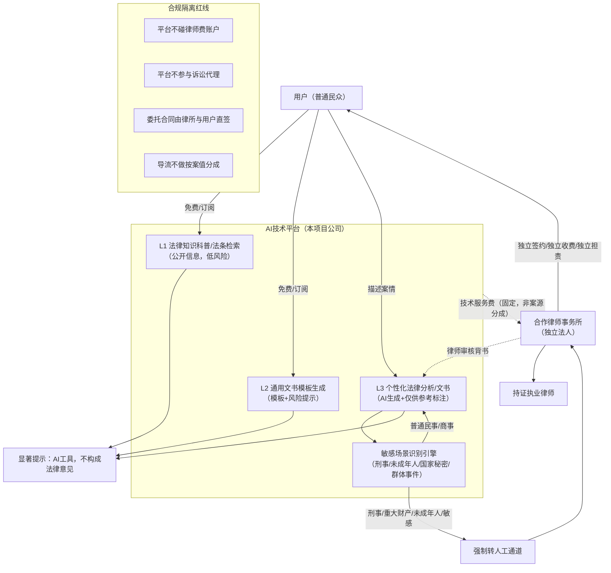

# 法律AI智能体项目——中国大陆监管合规调研报告

> 调研时间：2026年9月29日
> 调研范围：中国大陆法律AI产品（法律咨询、文书生成、维权指引、律师连接）
> 法规基准日：2026年9月（含2026年9月7日最高法《涉人工智能纠纷案件意见》）

---

## 核心发现（摘要）——合规红线清单

### 【必须做】（合规底线，缺一不可）

1. **必须完成生成式AI服务备案（大模型备案）+ 算法备案（"双备案"）后才能上线运营。** 自研或深度微调大模型面向公众提供服务的，须向属地网信办申报、国家网信办终审公示，周期通常4–8个月；仅通过API调用已备案模型的应用，由地方网信办做产品登记。截至2026年8月31日，全国仅1112款生成式AI服务完成备案。未备案即面向公众提供服务，面临下架、罚款。（依据：《生成式人工智能服务管理暂行办法》第17条；《互联网信息服务算法推荐管理规定》）

2. **必须在产品显著位置持续标注"本产品为AI工具，不构成法律意见、不替代律师代理"。** 每次AI输出法律相关内容时都应重复提示，而非仅在用户协议里藏一条。（依据：《暂行办法》第10条——提供者应明确公开服务适用人群、场合、用途；《律师法》第13条）

3. **必须建立投诉举报机制、内容安全审核机制、违法输入拦截机制。** 依据《暂行办法》第14、15条，发现用户利用服务从事违法活动应警示、限流、暂停服务，保存记录并向主管部门报告。

4. **必须将刑事辩护、刑事会见、取保候审申请、出庭诉讼代理等业务100%转人工（持证律师），AI不得给出实体性辩护策略建议。** 刑事辩护是《律师法》特许业务，AI公司无资质介入即构成非法执业风险。（依据：《律师法》第13条；《刑事诉讼法》第33条）

5. **必须对用户咨询内容做敏感个人信息保护：单独同意、数据最小化、加密存储、限期删除。** 婚姻状况、刑事案件信息、财产账户等属PIPL第28条敏感个人信息范畴，须有特定目的+充分必要性+严格保护措施。

6. **必须使用境内已备案模型、境内数据存储，原则上不得直接调用境外大模型API处理中国用户法律咨询数据。** 调用境外API涉及数据出境，须通过安全评估/标准合同/认证，法律咨询数据敏感度高，实操中应优先使用境内已备案模型。（依据：PIPL第38–40条；《数据出境安全评估办法》）

7. **必须在用户协议中设置责任限制条款、风险提示条款，并保留用户书面确认记录。** 但须清醒认识：免责声明"绝非万能通行证"，仅能降低过错推定，不能免除因重大过失/故意造成的责任。

8. **必须在涉及重大财产权益、诉讼时效、刑事风险时主动触发"转律师"人工通道，并与正规律所建立独立的委托签约关系。**

### 【禁止做】（触碰即红线）

9. **禁止以"律师""法律顾问""维权专家""包赢""100%胜诉""不赢不收费"等名义或话术对外宣传。** AI公司不是律所，名称不得含"律师""律所"字样；不得承诺办案结果、不得宣示胜诉率。（依据：《律师执业管理办法》第33条；《全国律协律师业务推广行为规则》；《广告法》第4条）

10. **禁止AI直接生成"代理词/辩护词"供用户直接提交法院而无人工律师审核，更禁止AI代为出庭、代为提交立案材料、代为会见。** 诉讼代理、刑事辩护为律师专属业务。

11. **禁止与律所进行"案源分成""挂靠资质""代持合伙份额""咨询公司实际控制律所"等合作。** 2025–2026年郑州、泉州等地已出台专门规定严查律所与法律咨询机构违规合作，实质控制关系穿透认定。

12. **禁止引导用户毁灭/伪造证据、串供、威胁引诱证人。** AI若输出此类建议，平台可能被认定为帮助妨害作证，触及《刑法》第306条辩护人伪证罪、第307条妨害作证罪的帮助行为边界。

13. **禁止处理不满14周岁未成年人的法律咨询而无监护人同意；禁止向未成年人推送离婚、刑事等不适龄内容。**

14. **禁止在AI生成的法律文书上标注"AI律师出具"或冒充律师签章；禁止伪造裁判文书、案例检索结果（最高法2026意见明确可罚款、拘留乃至追究刑责）。**

15. **禁止将用户法律咨询数据用于模型训练而不取得单独同意；禁止出境、出售、共享给第三方用于广告营销。**

---

## 一、生成式AI监管框架

### 1.1 法规体系（三部规章构成核心）

| 法规名称 | 生效时间 | 文号 | 监管对象 |
|---|---|---|---|
| 《互联网信息服务算法推荐管理规定》 | 2022年3月1日 | 网信办等四部门令第9号 | 算法推荐机制（含生成合成类算法） |
| 《互联网信息服务深度合成管理规定》 | 2023年1月10日 | 网信办等三部门令第12号 | 深度合成服务（AI生成文本/图像/音视频） |
| 《生成式人工智能服务管理暂行办法》 | 2023年8月15日 | 七部门令第15号 | 生成式AI服务（面向公众提供） |

> **注意**：三部规章叠加适用。一个法律AI对话产品同时落入"生成合成类算法"+"深度合成"+"生成式AI服务"三个范畴，须履行对应备案义务。

### 1.2 备案要求清单

| 备案事项 | 触发条件 | 受理/终审 | 材料要点 | 周期 |
|---|---|---|---|---|
| **算法备案**（算法推荐规定） | 具有舆论属性或社会动员能力 | 属地网信办初审→国家网信办终审 | 算法安全自评估报告、算法机制机理、训练数据来源、安全评估报告 | 约30个工作日反馈，含补正共约2–4个月 |
| **深度合成算法备案** | 深度合成服务提供者/技术支持者 | 同上，同一系统(beian.cac.gov.cn) | 深度合成安全评估、标识方案 | 同上 |
| **生成式AI服务备案（大模型备案）** | 面向公众提供生成式AI服务（自研/微调模型） | 省级网信办复审+征求发改/教育/公安/广电等部门意见→国家网信办公示 | 语料安全、模型安全测试报告、安全评估、服务协议、投诉举报机制 | 总周期约4–8个月（前期准备2–4周+属地申报1–2周+材料审核45天+终审公示1–2月） |
| **生成式AI应用登记** | 仅通过API调用已备案模型、未自研模型 | 地方网信办登记 | 调用关系说明、应用层安全措施 | 较短 |

**关键实操要点：**
- 备案系统：https://beian.cac.gov.cn
- 通过API调用已备案模型的应用，须在产品显著位置公示所用已备案模型名称及备案号。
- 完成备案后须在App/网站显著位置标明备案编号并提供公示链接。
- "免费"不豁免备案——面向公众提供即须备案。

### 1.3 2024–2026年新规动态

- **《网络数据安全管理条例》**（国务院令第790号，2025年1月1日施行）：细化重要数据识别、数据出境、网络平台义务。
- **《个人信息出境认证办法》**（2025年10月施行）：数据出境三条路径（安全评估/标准合同/认证）。
- **《互联网信息服务管理办法（修订草案征求意见稿）》**（2026年7月再次征求意见）：进一步压实平台主体责任。
- **最高法《关于依法审理涉人工智能纠纷案件的意见》**（法发〔2026〕10号，2026年9月7日发布，共24条）——**本项目最关键的新规**，核心规则见下文第四章。
- **人工智能法立法进展**：已列入十四届全国人大常委会立法规划；2025、2026年度全国人大常委会立法工作计划将其列为"预备审议/调研起草"项目；国务院2026年度立法工作计划提出"加快推进人工智能健康发展综合性立法"。**目前尚未正式出台法律，仍以三部规章+司法意见为主。** 创业期间须持续跟踪立法动态。

### 1.4 已备案法律类大模型/应用参考

- 全国已备案大模型中，法律垂直场景已出现：如北京面壁智能"法治·复议"大模型（2025年12月备案）；广东2026年8月新增备案覆盖法律垂直场景；阿里"通义法睿"（基于通义千问法律行业训练，提供法律对话、文书生成、类案检索、合同审查）。
- 通义法睿定位为"大模型时代的AI法律顾问"，基础服务免费、高级服务（定制合同、专家咨询、深度文书）按次/订阅收费——其商业模式本身即"AI工具+人工专家服务"分层，是本项目可对标的合规路径。

---

## 二、"从事法律服务"的资质边界（核心）

### 2.1 法律框架

| 主体 | 执业许可 | 可从事业务 | 不可从事业务 |
|---|---|---|---|
| **律师/律师事务所** | 司法行政部门颁发律师执业证/律所执业许可证 | 全部诉讼代理、刑事辩护、非诉法律事务、法律咨询、代书 | —（特许垄断） |
| **基层法律服务工作者** | 司法局颁发法律服务工作者证 | 辖区内民事/行政诉讼代理、调解仲裁、咨询、代书 | **刑事辩护/代理**；跨辖区诉讼代理受限 |
| **法律咨询公司（市场主体）** | 仅市场监管部门登记营业执照 | 日常法律咨询、普通文书草拟、非诉信息咨询 | **禁止**诉讼代理、出庭立案、刑事辩护、刑事会见；不得以律师名义执业 |
| **AI公司（本项目）** | 增值电信业务经营许可(ICP/EDI等)+生成式AI备案 | 法律信息检索、法律知识科普、文书模板生成、类案检索展示、风险提示 | **同法律咨询公司**，且不得冒充律师 |

**核心法条：**
- 《律师法》第13条：没有取得律师执业证书的人员，不得以律师名义从事法律服务业务；除法律另有规定外，不得从事诉讼代理或者辩护业务。
- 《律师法》第55条：无证以律师名义从事法律服务业务的，由县级以上司法行政部门**责令停止非法执业，没收违法所得，处违法所得1倍以上5倍以下罚款**。
- 《基层法律服务工作者管理办法》（司法部令第138号）第26条：法工可担任法律顾问、代理民事/行政诉讼、解答咨询、代书；第27条限制诉讼代理地域；**明确排除刑事辩护**。

### 2.2 AI公司如何设计才能避免被认定违规

**判断标准（穿透实质）：** 监管看实质而非表面合同——只要AI/平台"借律所资质对外经营、以律所名义承揽案件、实际控制业务流程和收费分配"，即被认定为规避监管（财新2026年5月调查、郑州/泉州2026年新规均持此立场）。

**安全区（可做）：**
- 法律知识科普、法条/案例检索展示（注明来源）
- 通用法律文书模板生成（起诉状、合同模板），明确标注"模板，建议律师审核"
- 流程指引（起诉需要什么材料、去哪个法院、诉讼时效多久）
- 风险分级提示（"本案可能涉及刑事风险，建议尽快咨询律师"）
- 中立的律师推荐/导流（用户自主选择，平台不参与委托关系、不分成案源）

**灰色区（须严格隔离+人工审核）：**
- 具体案件的法律分析意见 → 须标注"AI生成、仅供参考"，重大案件转律师
- 个性化文书起草 → 须由合作律师审核背书后交付，或仅提供模板由用户自行填写

**禁区（绝对不可做）：**
- 刑事辩护策略指导、会见指导、取保候审申请文书代写
- 代为起诉/立案/出庭/签收法律文书
- 以"我们的律师团队"名义对外揽案并自行收费
- 承诺案件结果、包赢

### 2.3 与律所合作的合规架构

2025–2026年监管显著收紧。《郑州市律师事务所、律师与法律咨询服务机构违规合作处理办法（试行）》（2026）及泉州等地规定明确**七大红线**：
1. 禁止律所向咨询机构转让出资份额、委托经营管理律所；
2. 禁止通过代持合伙份额让咨询机构实际控制律所；
3. 禁止律所/律师出资、控股、参股咨询机构；
4. 禁止案源介绍费、代理费分成；
5. 禁止将诉讼/仲裁/证据收集/出庭等核心业务外包给咨询机构；
6. 禁止以"法律顾问""战略合作""共建平台"名义变相合作；
7. 禁止为咨询机构超范围经营提供便利。

> **结论**：传统"挂靠/联营/案源分成"模式在2026年已被明确封堵。本项目应采用**纯中立技术平台模式**（见下文架构图）。

---

## 三、推荐合规业务架构

**架构要点说明：**
1. **三层服务分层**：L1纯信息（最安全）→ L2模板工具 → L3AI辅助分析（最高风险，须强提示+人工复核）。
2. **敏感场景强制熔断**：Guard引擎识别到刑事、未成年、国家秘密、群体事件等，AI停止输出实体建议，仅给出"请立即联系律师/法援中心"指引。
3. **律所独立**：律所是独立法人，与平台仅签**技术服务协议**（收固定技术费），不签案源分成协议；委托合同由律所与用户直签，律师费由律所收取，平台不经手。
4. **律师审核背书**：L3输出的个性化文书，如用户选择付费深度服务，由合作律师审核后交付，此时责任在律所（受律师法第54条律所赔偿责任约束）。

---

## 四、输出责任划分（最高法2026意见核心）

2026年9月7日最高法《关于依法审理涉人工智能纠纷案件的意见》（法发〔2026〕10号）确立的规则：

1. **归责原则**：利用AI侵害民事权益，除法律明确规定无过错责任或过错推定外，**适用过错责任原则**。即用户主张平台赔偿，须证明平台有过错。
2. **严格认定"AI产品"**：将AI产品限定为**以实物为载体**的产品（智能机器人、自动驾驶汽车等）；**没有实物载体的AI服务（如法律AI对话）排除在产品责任之外**。这意味着本项目作为软件/服务，不承担产品责任中的无过错责任，这是有利的一面。
3. **生成式AI参照"避风港规则"**：AI自动生成内容侵权（如生成错误法律建议损害用户），经权利人/用户通知后，平台**未及时采取停止生成、屏蔽等必要措施**的，对损害扩大部分承担侵权责任；及时采取措施的，通常免责。
4. **用户恶意诱导**：用户通过提示词恶意诱导AI生成侵权内容的，用户担责；平台接到通知后未处置的，承担相应责任。
5. **AI伪造证据**：诉讼参与人利用AI伪造证据、妨碍法院审理的，依民诉法第114条罚款/拘留，构成犯罪追刑责；**诉讼参与人对AI生成的诉讼文书、案例检索报告负有核实说明义务**，不得以"AI幻觉"免责。

**对本项目的责任启示：**
- 错误法律建议致用户损失 → 原则上按**过错责任**，平台若已尽到风险提示、人工复核、及时更正义务，可显著减责。
- **免责声明不是万能的**（法治网2026年5月报道，专家王风和观点）：它首先是风险提示，其次才是责任考量；若平台明知AI存在系统性错误仍放任输出，仍可能被认定过错。
- **职业责任保险**：现有"律师职业责任保险"（平安等）覆盖律师在执业中因过失致委托人损失的赔偿。本项目应：(a) 要求合作律所投保律师执业责任险；(b) 自身投保**网络安全责任险+科技产品职业责任（E&O）保险**，覆盖因AI输出错误引发的用户索赔。

---

## 五、免责声明必备条款清单

用户协议/免责声明应至少包含以下条款（参考通义法睿隐私政策、千问用户协议、律图服务协议、法临用户协议的通行做法）：

1. **性质界定条款**："本服务为人工智能信息工具，不提供律师执业服务，不构成法律意见、法律建议或律师代理关系。"
2. **不保证准确性条款**："AI生成内容可能存在错误、过时或'幻觉'，使用者应自行核实，平台不对其准确性、完整性、时效性作明示或默示担保。"
3. **风险提示条款**："法律问题高度依赖具体事实和证据，AI输出仅为一般性信息参考。涉及诉讼时效、重大财产权益、刑事风险的，请务必咨询持证律师。"
4. **用户自行决策条款**："用户基于AI输出作出的任何决定及后果由用户自行承担。"
5. **责任限制条款**（在法律允许范围内）："在适用法律许可范围内，平台不对间接、惩罚性、特殊、派生损失承担赔偿责任；平台累计赔偿责任以用户实际支付费用为限。"
6. **禁止滥用条款**：用户不得利用本服务从事违法活动（如伪造证据、妨害作证），否则平台有权终止服务并报告主管部门。
7. **AI生成标识条款**：明确所有AI生成内容已标注"AI生成"，用户提交法院时须自行核实并披露AI使用情况。
8. **转人工/投诉入口条款**：显著位置提供转律师、投诉举报入口，公布处理流程和反馈时限。
9. **未成年人条款**：不满14周岁未成年人须监护人陪同使用，平台对未成年人信息从严保护。
10. **数据使用条款**：明确用户咨询数据是否用于模型训练（建议默认不用于训练，或取得单独同意后用于脱敏训练）。

> **注意**：免责条款须以**加粗/下划线/弹窗确认**方式提请用户注意，并保留用户点击确认的日志，否则可能被认定为未尽提示义务。

---

## 六、数据安全与个人信息

### 6.1 适用法律
- 《网络安全法》（2017.6.1施行）
- 《数据安全法》（2021.9.18施行）
- 《个人信息保护法》（PIPL，2021.11.1施行）
- 《网络数据安全管理条例》（2025.1.1施行）

### 6.2 法律场景的特殊风险
用户法律咨询内容高度敏感：婚姻状况、家庭矛盾、刑事案件细节、财产状况、商业秘密——其中**特定身份、金融账户、行踪轨迹、不满14周岁未成年人信息**属PIPL第28条明确列举的敏感个人信息；婚姻/刑事细节虽未逐条列举，但一旦泄露易致人格尊严/人身财产损害，应按敏感信息从严保护。

### 6.3 合规要求

| 要求 | 具体措施 | 法条依据 |
|---|---|---|
| 单独同意 | 收集咨询内容前弹窗告知用途、保存期限，取得单独同意（非一揽子勾选） | PIPL第14、29条 |
| 数据最小化 | 仅收集必要信息，不强制收集身份证号、住址；可匿名化的不收集 | PIPL第6条 |
| 严格保护措施 | 传输加密(TLS)、存储加密(AES)、访问权限最小化、审计日志 | PIPL第51条 |
| 存储期限 | 咨询记录约定期限（如注销即删除/匿名化），不得无限期留存 | PIPL第19条 |
| 数据出境 | **不得直接将中国用户咨询数据发送境外API**（如调用GPT/Claude）；须用境内已备案模型；确需出境须走安全评估/标准合同/认证 | PIPL第38–40条；《数据出境安全评估办法》 |
| 案件秘密 | 如涉及在办案件信息、国家秘密，禁止存储/训练，并立即提示用户脱敏 | 《保守国家秘密法》《律师法》第38条律师保密义务参照 |

---

## 七、广告与宣传合规

| 禁止行为 | 法规依据 |
|---|---|
| 不得承诺办案结果（"包赢""保证胜诉""承诺回款"） | 《律师执业管理办法》第33条 |
| 不得宣示胜诉率、赔偿额、标的额（"99%胜诉率"） | 《全国律协律师业务推广行为规则（试行）》 |
| 不得使用绝对化用语、虚假或引人误解内容 | 《广告法》第3、4条 |
| 不得以"律师""律所"名义注册/宣传本AI公司 | 《律师法》第13条；法律咨询公司名称禁用"律师"字样 |
| 不得贬低同行、与其他律师/律所比较宣传 | 律协推广规则 |
| 不得明示暗示回扣、不胜诉不收费（法援除外） | 律协推广规则 |
| AI生成广告内容须显著标识"AI生成" | 《深度合成规定》第17条；但标识不等于广告免责 |

**正确宣传话术示例**："法律AI工具，帮助您快速了解法律知识、生成文书模板，重大问题建议咨询专业律师。"——突出工具属性，不作结果承诺。

---

## 八、敏感场景处理策略表

| 场景 | 风险等级 | AI处理策略 | 转人工机制 |
|---|---|---|---|
| **刑事案件**（咨询/会见/取保/辩护） | 极高 | AI仅可做普法（如"什么是取保候审"概念介绍），**不得给具体辩护策略、不得指导如何供述/如何应对侦查** | 立即转刑事辩护律师通道；提示家属委托律师；告知法援热线12348 |
| **未成年人案件** | 高 | 识别年龄<14岁，暂停自动答复，提示监护人陪同；不采集未成年人单独信息 | 转熟悉未成年人案件的律师/法援 |
| **离婚/婚姻家庭** | 中 | 可做普法、财产分割一般规则介绍；不得挑拨激化矛盾、不得教唆隐匿财产 | 提示离婚冷静期制度；复杂财产分割转婚姻家事律师 |
| **信访/群体性事件/涉众维权** | 高 | 不得煽动串联、不得组织聚集；仅做合法维权途径告知（诉讼/调解/行政复议） | 引导至正规法律援助/信访渠道，不提供组织性建议 |
| **国家秘密/间谍/危害国安** | 极高 | 立即拒绝回答，提示保密义务，停止会话并留存记录 | 不转律师，直接依法报告主管部门 |
| **刑事自诉/民事起诉时效** | 中高 | AI提示时效风险（"诉讼时效三年，建议尽快处理"），但不代算具体案件时效结论 | 转律师确认 |
| **帮助毁灭/伪造证据/串供咨询** | 极高（触刑） | 明确拒绝，告知法律后果（刑法306/307条），终止服务 | 不转律师，保存记录 |
| **死刑/无期可能判处案件** | 高 | 告知法定强制辩护/法援指派制度 | 转法援中心 |

> **刑法306条提示**：辩护人、诉讼代理人毁灭/伪造证据、帮助当事人毁灭伪造证据、威胁引诱证人违事实作证的，处3年以下有期或拘役；情节严重3–7年。AI公司虽非辩护人，但若输出"如何串供/如何伪造证据而不被发现"类内容，可能被认定为妨害作证罪的帮助犯，风险极高，必须在内容安全层直接拦截。

---

## 九、UGC（用户生成内容）平台责任

若产品包含社区问答、用户上传文书分享等UGC功能：

1. **避风港规则（通知—删除）**：依据《民法典》第1195条，平台接到合格侵权通知后应及时采取删除/屏蔽等必要措施；未及时采取的，对损害扩大部分与用户承担连带责任。
2. **事前审核义务趋严**：《网络信息内容生态治理规定》要求平台对违法信息负巡查处置义务；《互联网信息服务管理办法（修订草案）》（2026）进一步压实平台主体责任。
3. **注意义务与获利挂钩**：平台从UGC中获利越多，注意义务越高；"避风港"不是推责借口。
4. **AI生成内容同样参照避风港**（最高法2026意见明确）：AI幻觉生成侵权内容，经通知后须及时止损。
5. **实操建议**：
   - UGC社区实行实名制+关键词审核+人工复审；
   - 用户发布的法律建议类内容标注"非专业意见，仅供参考"；
   - 建立便捷投诉举报入口（《暂行办法》第15条强制要求）；
   - 保存日志备查。

---

## 十、DoNotPay案对中国产品的警示

**案件事实：**
- DoNotPay自称"全球首个机器人律师"，2024年9月被美国FTC起诉，2025年2月11日达成同意令。
- **处罚：支付19.3万美元（$193,000）消费者赔偿**，并被要求：停止宣传AI具备人类律师同等水平、通知受影响订阅用户、提交合规报告。
- FTC核心指控：DoNotPay**未测试AI是否达到人类律师水平，未聘请律师测试其法律功能的质量与准确性**。
- 另面临多起集体诉讼：加州UPL（无证执业）指控、伊利诺伊州律师集体诉讼、消费者欺诈集体诉讼。

**对中国产品的五条警示：**

| 警示 | DoNotPay教训 | 本项目对策 |
|---|---|---|
| 1. 不得宣传为"律师" | 自称"robot lawyer"是UPL指控核心 | 永远称"AI法律工具/助手"，不称律师/法律顾问 |
| 2. 必须有律师测试/审核 | FTC指控其从未让律师验证输出质量 | L3个性化输出须有持证律师抽样审核、建立质量评估机制 |
| 3. 不得夸大能力 | 虚假宣传是FTC处罚主因 | 广告严格不作结果承诺，明示AI局限 |
| 4. 无证执业红线 | 加州UPL诉讼 | 严守律师法第13条，不碰诉讼代理/刑事辩护 |
| 5. 消费者救济机制 | FTC要求退款通知 | 建立完善投诉退款、用户反馈闭环 |

---

## 参考来源

1. 《生成式人工智能服务管理暂行办法》全文（国家网信办）：https://www.cac.gov.cn/2023-07/13/c_1690898327029107.htm
2. 《生成式人工智能服务管理暂行办法》（中国政府网公报版）：https://www.gov.cn/gongbao/2023/issue_10666/202308/content_6900864.html
3. 《互联网信息服务深度合成管理规定》（国家网信办）：https://www.cac.gov.cn/2022-12/11/c_1672221949354811.htm
4. 国家网信办：2026年7–8月生成式AI服务备案公告（累计1112款）：https://www.cac.gov.cn/2026-09/14/c_1791136833136332.htm
5. 国家网信办：2024年生成式AI服务已备案信息公告：https://www.cac.gov.cn/2025-01/08/c_1738034725920930.htm
6. 互联网信息服务算法备案系统：https://beian.cac.gov.cn/
7. 最高法《关于依法审理涉人工智能纠纷案件的意见》新闻发布：https://www.court.gov.cn/zixun/xiangqing/511101.html
8. 最高法相关部门负责人就AI纠纷意见答记者问：https://www.court.gov.cn/zixun/xiangqing/511111.html
9. 《中华人民共和国律师法》（中国人大网）：http://www.npc.gov.cn/npc//c2/c30834/201905/t20190521_278153.html
10. 《律师执业管理办法》（司法部）：https://www.moj.gov.cn/policyManager/regulationDetail.html?pkid=ec0f0848b9644616a9bcc862abfc4718&showMenu=false&showFileType=1
11. 《基层法律服务工作者管理办法》（司法部令第138号）：https://www.gov.cn/gongbao/content/2018/content_5280585.htm
12. 《中华人民共和国个人信息保护法》（国家网信办）：https://www.cac.gov.cn/2021-08/20/c_1631050028355286.htm
13. 《网络数据安全管理条例》（国家网信办）：https://www.cac.gov.cn/2024-09/30/c_1729384452307680.htm
14. 数据出境安全管理政策法规问答（2026年9月，国家网信办）：https://www.cac.gov.cn/2026-09/11/c_1790876549989064.htm
15. 《中华人民共和国法律援助法》（司法部）：https://www.moj.gov.cn/pub/sfbgw/jgsz/jgszzsdw/zsdwflyzzx/flyzzxzcxx/zcxxzcfg/zcfgfl/202109/t20210901_436729.html
16. 《中华人民共和国广告法》（中国政府网）：https://www.gov.cn/guoqing/2021-10/29/content_5647620.htm
17. 全国律协：律师服务广告不得进行误导性宣传（央广网）：http://news.cnr.cn/native/gd/20180218/t20180218_524138271.shtml
18. 财新周刊：网推"律所"乱象透视（律所与咨询公司违规合作）：https://weekly.caixin.com/2026-05-09/102442269.html
19. 对话许身健：律师不能成为网推虚假营销的"合法化环节"：https://china.caixin.com/2026-05-12/102443348.html
20. 通义法睿产品页（阿里云）：https://tongyi.aliyun.com/farui/home
21. 通义法睿隐私政策：https://terms.alicdn.com/legal-agreement/terms/privacy_policy_full/20231026151725742/20231026151725742.html
22. 律图律师服务使用协议：https://m.64365.com/help/667705.aspx
23. 法治网：AI"幻觉"侵权纠纷——技术与责任的边界：http://www.legaldaily.com.cn/Company/content/2026-05/06/content_9384006.html
24. 光明网：AI造假可追究刑责！最高法发布新规：http://legal.gmw.cn/2026-09/07/content_38989196.htm
25. DoNotPay FTC同意令分析（Federal Register）：https://www.federalregister.gov/documents/2024/09/30/2024-22400/donotpay-inc-analysis-of-proposed-consent-order-to-aid-public-comment
26. DoNotPay UPL集体诉讼分析（ABA Journal）：https://www.abajournal.com/magazine/article/inside-the-claims-against-donotpays-joshua-browder-and-the-worlds-first-robot-lawyer
27. 国务院2026年度立法工作计划（人工智能综合性立法）：https://www.gov.cn/zhengce/content/202605/content_7068345.htm
28. 中国人大网：构建全面科学的人工智能法律制度体系（AI立法进展）：http://www.npc.gov.cn/npc/c2/c30834/202506/t20250617_445777.html
29. 南昌市司法局：关于规范我市法律咨询服务市场告知书：http://sfj.nc.gov.cn/ncsfj/gkgsgg/202606/1cfb11e6093a47a2a7d1552279e7dae4.shtml
30. 中国保险行业协会：律师职业责任保险条款：https://www.iachina.cn/col/col3589/index.html
