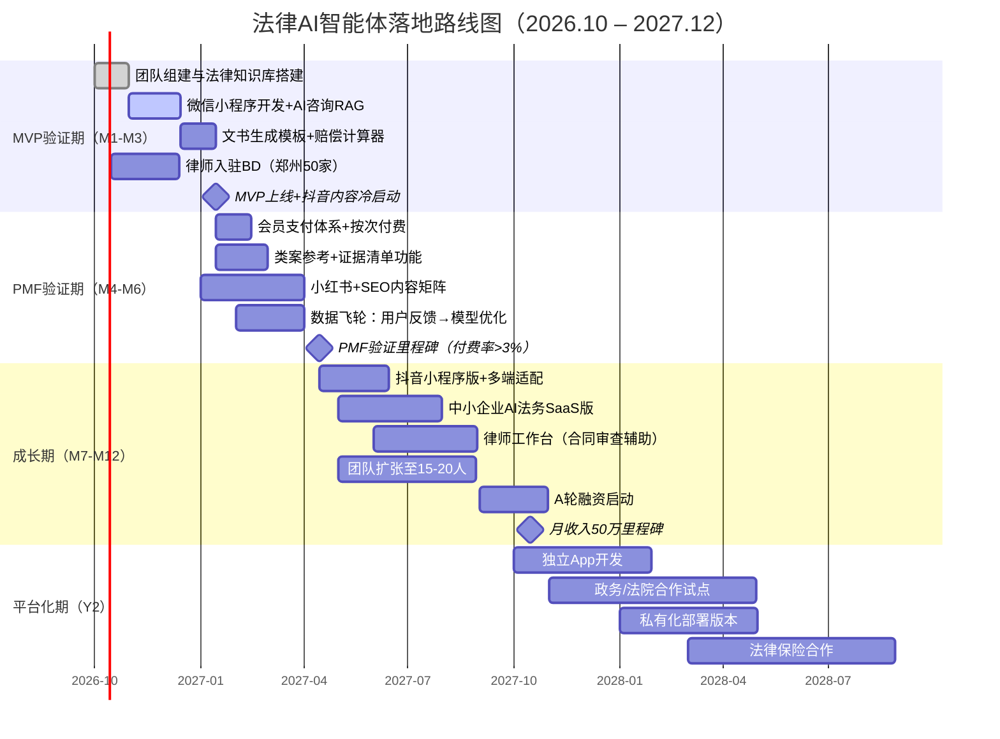

# 法律AI智能体产品与商业落地调研报告

> 调研时间：2026年9月 | 项目定位：面向中国市场的普惠型法律AI智能体 | 创业地：郑州（新一线城市）
> 数据基准：2024–2026年公开资料，关键定价/薪资/云价均标注来源

---

## 核心发现与建议（摘要）

1. **MVP应先做"微信小程序+智能法律咨询+文书生成"三件事**，而非一上来做App。微信生态获客成本最低、信任门槛最低、分享裂变最快，且郑州团队3个月可交付。
2. **C端不要做"大而全"的AI律师**，应聚焦3–5个高频刚需场景：劳动纠纷（离职补偿N+1/工伤）、交通事故赔偿、民间借贷、离婚财产、消费维权。这些场景搜索量大、决策链短、付费意愿明确。
3. **第一年收入核心引擎不是会员费，而是"律师导流佣金"**。参考华律网模式：律师端按成案抽佣10%–20%，C端VIP 99元/月。AI免费做流量入口，真人律师做变现出口，毛利率可达55%–60%。
4. **文书生成是最佳"按次付费"切入点**。起诉状/答辩状/劳动仲裁申请书等，AI生成定价19.9–49.9元/份（对比律师代写300–3000元/份），用户感知性价比极高，且边际成本接近零（每份token成本约0.05–0.2元）。
5. **B端SaaS不要在MVP阶段碰**。幂律智能做了6年才到Pre-B轮8000万融资，MeCheck合同审查系统主打大企业，销售周期6–12个月。小团队应先C端跑通PMF，第9–12个月再以"吾律"式轻量企业版切入中小企业。
6. **模型策略：不要自研大模型，用API + RAG + 微调法律知识库**。DeepSeek-V4-Flash输入1元/百万tokens、输出4元/百万tokens（空闲时段），Qwen-plus输入0.8元、输出2元，单用户日均咨询成本可控制在0.1–0.3元。
7. **郑州人力成本优势显著**：算法工程师10–20K/月、全栈开发14–18K、产品经理12–23K，约为北上广同岗位的55%–65%。8人核心团队年人力成本约80–110万（郑州），北上广需150–200万。
8. **第一年现金需求约180–260万元**（郑州团队），其中人力占60%–70%，云服务+模型API占8%–12%，数据采购+合规备案占5%–8%，市场运营占15%–20%。
9. **冷启动获客首选抖音/小红书普法短视频+SEO问答**。法律问题搜索流量精准、转化率高（参考华律网/找法网十余年SEO积累），但新团队应从短视频切入——抖音"劳动仲裁""离职赔偿"类内容流量池巨大，且可直接挂载小程序。
10. **刑期预测类功能法律风险极高，MVP阶段必须做"信息参考+免责声明"，不得作为确定性输出**。刑事辩护涉及公民自由，错误建议可能引发投诉与监管风险，建议放到V2且标注"仅供参考，务必咨询律师"。
11. **政务/法院采购是长期蛋糕但不适合初创期**。智慧法庭项目单标43万–170万不等，但招标周期6–12个月、需资质与案例积累，建议第二年通过与华宇/北大法宝等集成商合作分包切入。
12. **数据飞轮的核心是"用户真实案例→标注反馈→模型微调→更好建议→更多用户"**。必须从第一天就设计用户反馈机制（回答是否有帮助/是否解决问题），积累的"用户真实问题+律师验证答案"是最核心壁垒。
13. **竞争壁垒不在模型本身（模型趋同），而在：①法律知识库的结构化深度 ②律师网络密度 ③用户案例数据飞轮 ④政务/律所渠道关系**。前两者MVP即可启动，后两者需要时间积累。
14. **建议创始团队最小配置4人**：CEO（懂法律+产品）+全栈工程师1人+算法/AI工程1人+法律专家（可兼职顾问，建议1名执业律师+1名前法官/检察官）。3个月出MVP，6个月验证PMF。
15. **关键风险提示**：①生成式AI内容合规（需《生成式人工智能服务管理暂行办法》备案）②法律建议责任边界（必须明确"不构成法律意见"）③大模型API涨价风险（2025年已有7成厂商涨价趋势，需做多模型路由）。

---

## 一、产品功能模块设计

### 1.1 C端核心功能矩阵

| 模块 | 功能说明 | 用户痛点 | 技术难度 | 付费潜力 | MVP优先级 |
|------|----------|----------|----------|----------|-----------|
| 智能多轮法律咨询 | 对话式AI，理解案情、追问细节、给出初步分析 | 普通人不知道自己有什么权利 | 中（RAG+Prompt工程） | 引流核心 | P0（Must） |
| 法条解读 | 输入法条号/关键词，大白话解释+适用场景 | 法条看不懂、不知道哪条管用 | 低（结构化法条库+生成） | 引流 | P0（Must） |
| 法律文书生成 | 起诉状/答辩状/劳动仲裁申请书/借条/合同模板 | 不会写、找律师贵 | 中高（模板+变量填充+生成） | **核心变现** | P0（Must） |
| 赔偿估算器 | 工伤/交通事故/人身损害/劳动N+1/抚养费计算器 | 不知道能赔多少钱 | 低（规则引擎+参数表单） | 引流+裂变 | P0（Must） |
| 维权指引/诉讼流程 | 分步指引：先协商→仲裁→起诉，各阶段材料/时间/费用 | 不知道下一步该干嘛 | 低（流程知识图谱） | 留存 | P1（Should） |
| 证据清单生成 | 根据案情自动列出需准备的证据清单 | 不知道要收集什么证据 | 中（案情分类+证据规则库） | 增值 | P1（Should） |
| 类案参考 | 类似案例判决结果摘要（脱敏） | 不知道法院会怎么判 | 中高（裁判文书检索+摘要） | 增值 | P1（Should） |
| 诉讼费用计算器 | 按标的额计算诉讼费/律师费参考 | 打官司要花多少钱 | 低（公式计算） | 引流 | P1（Should） |
| 律师匹配/导流 | AI初筛后推荐本地执业律师，电话/微信对接 | 不知道找哪个律师 | 中（匹配算法+律师库） | **核心变现** | P1（Should） |
| 普法内容 | 短视频脚本/问答文章/图文干货 | 法律意识淡薄 | 低（内容生产+分发） | 获客渠道 | P1（Should） |
| 刑期预测参考 | 刑事罪名→量刑区间参考 | 家属急切想知道判多久 | 高（量刑规则+风险） | 高但风险大 | P2（Could） |
| 合同审查（C端） | 上传合同，AI标出风险点 | 租房/劳动/借款合同不敢签 | 中高（合同NLP+风险库） | 增值 | P2（Could） |
| 法律费用保险 | 按月付费，未来发生纠纷可覆盖律师费 | 担心打官司花钱 | 高（需保险合作） | 远期 | P3（Won't） |

### 1.2 B端/律师端功能矩阵

| 模块 | 目标用户 | 功能说明 | 付费潜力 | 启动阶段 |
|------|----------|----------|----------|----------|
| 合同审查（AI初审） | 企业法务/律师 | 上传合同→风险点标注→修改建议 | 高（对标幂律MeCheck） | V2（第6个月后） |
| 案例检索/法律研究 | 律师 | 类案检索、法规检索、裁判文书摘要 | 中（对标北大法宝，壁垒高） | V2 |
| 文书批量生成 | 律师/法务 | 批量生成函件、合同、答辩状 | 中高 | V2 |
| 案件管理系统 | 中小律所 | 案件进度、文档、客户管理 | 中（竞品多） | V3 |
| 尽职调查辅助 | 律所/企业 | 企业工商/涉诉/风险信息汇总 | 高（对标企查查+法律） | V3 |
| 企业知识库 | 大企业法务 | 内部制度+外部法规统一问答 | 高（需私有化部署） | V3 |
| 律师工作台插件 | 律师 | 飞书/企微/钉钉插件，AI辅助写作 | 中 | V2 |

---

## 二、功能优先级排序（RICE + MoSCoW）

### 2.1 评分方法说明

- **Reach（触达）**：预计每季度使用该功能的用户数（千人）
- **Impact（影响）**：对用户留存/付费的影响系数（3=极大，2=大，1=中，0.5=小）
- **Confidence（信心）**：基于数据的把握度（%）
- **Effort（成本）**：人月
- **RICE = Reach × Impact × Confidence ÷ Effort**

### 2.2 功能优先级矩阵（用户价值 × 实现成本）

| | **低成本** | **中成本** | **高成本** |
|---|---|---|---|
| **高用户价值** | ✅ **P0必做**：智能法律咨询、法条解读、赔偿估算器、诉讼费用计算器、文书生成（基础模板类） | ⚡ **P1应做**：律师匹配导流、维权指引、证据清单生成、普法内容矩阵 | 🔮 **P2可做**：类案参考、合同审查C端版 |
| **中用户价值** | 📋 P1：诉讼流程指引、文书生成（复杂类） | P2：企业知识库（轻量版） | P3：刑期预测、案件管理系统 |
| **低用户价值** | P3：法律费用保险、智能硬件 | P3：尽职调查 | ❌ 暂不做：私有化部署、政务终端 |

### 2.3 MVP功能清单（Must Have，3个月内交付）

| 功能 | 为什么必须做 | 预计RICE分 |
|------|-------------|-----------|
| 微信小程序端 | 获客成本最低、无需下载、社交裂变 | — |
| 智能多轮法律咨询（劳动/交通事故/借贷/离婚4大场景） | 核心流量入口，用户第一触点 | 95 |
| 法条速查与大白话解读 | 建立专业信任，SEO长尾流量 | 72 |
| 赔偿估算器（N+1/工伤/交通事故） | 工具属性强、易传播、用户主动分享 | 88 |
| 基础法律文书生成（起诉状/仲裁申请书/借条/离婚协议） | 第一笔付费收入，19.9–49.9元/份 | 82 |
| 律师匹配导流入口（先接入50–100家郑州本地律所） | 验证变现闭环，抽佣15%–20% | 76 |
| 用户反馈与评分机制 | 数据飞轮起点，优化回答质量 | 65 |
| 内容发布后台（普法短文/FAQ） | SEO+抖音引流落地页 | 58 |

---

## 三、交互形态选择

| 形态 | 优势 | 劣势 | 冷启动适配度 | 建议 |
|------|------|------|-------------|------|
| **微信小程序** | 无需下载、社交裂变强、微信支付闭环、中老年用户可用 | 留存弱、推送受限、功能受限 | ★★★★★ | **MVP首选** |
| 抖音/快手小程序 | 内容即服务、短视频挂载直接转化、流量大 | 留存极低、用户决策浅、支付链路长 | ★★★★ | **引流主阵地**，与微信小程序配合 |
| 独立App | 功能完整、推送强、品牌感强 | 获客成本高（单安装5–20元）、开发周期长 | ★★ | V2再考虑 |
| H5网页 | 开发快、SEO友好、跨平台 | 留存差、无法推送、微信内受限 | ★★★ | **SEO辅助**，做问答落地页 |
| 企业微信/飞书插件 | B端入口、企业付费意愿强 | 冷启动无企业资源 | ★★ | V2 B端切入 |
| 政务大厅终端 | 政府背书、精准用户 | 硬件成本高、采购周期长 | ★ | V3政务合作 |
| 智能硬件 | 差异化 | 成本高、市场未验证 | ★ | 不建议 |

**结论**：MVP = 微信小程序（主产品）+ 抖音/快手号（引流）+ H5问答页（SEO）。三套形态共用后端，前端轻量化。

---

## 四、商业模式对比

| 模式 | 客单价参考 | 优势 | 劣势 | 适用阶段 |
|------|-----------|------|------|----------|
| **C端免费+会员订阅** | 29–99元/月，199–399元/年（参考华律网99元/月） |  recurring revenue、用户粘性 | 中国用户付费习惯弱、转化率2%–5% | V1验证 |
| **C端按次付费（文书/咨询）** | 文书19.9–49.9元/份；AI深度咨询9.9–29.9元/次 | 即时付费、决策轻、边际成本低 | 单客价值低、需大流量 | **MVP核心** |
| **律师导流佣金** | 成案抽佣10%–30%（行业10%–25%，小律通30%） | 客单价高（案件代理费5000–5万）、零交付成本 | 需积累律师网络、成案率不稳定 | **MVP核心变现** |
| **B端SaaS订阅** | 基础版0.8–1.5万/年，专业版1.5–2.8万/年（JurisAI数据） | ARR高、续约率80%+ | 销售周期长、需POC、客情重 | V2（第6月后） |
| **B端私有化部署** | 10–50万/项目 | 大单、政府/大企业偏好 | 定制重、交付成本高 | V3 |
| **政府/法律援助采购** | 区县级法律援助项目50–120万/年；智慧法庭43–170万/标 | 稳定、背书强 | 资质门槛高、周期长、回款慢 | V2–V3 |
| **法律费用保险** | 月费10–30元 | 远期想象空间 | 需保险牌照合作、产品复杂 | V3 |
| **广告/流量变现** | CPA/CPC | 轻量 | 损伤体验、量级有限 | 辅助 |

**推荐组合**：
- **MVP阶段（0–6月）**：按次付费文书 + 律师导流佣金（双轮驱动）
- **成长期（6–18月）**：叠加C端会员（199元/年）+ B端轻量SaaS
- **平台期（18月+）**：政府/大企业私有化 + 法律保险生态

---

## 五、定价参考（2024–2026年实际数据）

### 5.1 现有法律AI/科技产品定价

| 产品 | 定价 | 来源时间 |
|------|------|----------|
| 法天使合同模板 | 单个6–24元/份，简单模板0元 | 2026.09 |
| 幂律智能·吾律（企业版） | 专业版9999元/年（50案+30份合同起草+50份审核）；高级版18999元/年（150份合同等） | 2026.08 |
| JurisAI法律SaaS | 基础版0.8–1.5万/年（小律所）；专业版1.5–2.8万/年（主力）；企业版2.8–5万/年 | 2025.11 |
| 华律网C端VIP | 99元/月；律师端成案抽佣10%–20% | 2025.11 |
| 智能小律通 | AI咨询0.5元/次起；律师抽佣30% | 2026.01 |
| 中律捷企业法顾套餐 | 钻石版10086元/年；合同文书500元/份；律师函500元/份；风险评估1000元/份 | 2025.09 |
| 企查查C端VIP | 388元/年（连续包年358元）；SVIP 1800元/年 | 2025.11 |
| WestLaw AI（对标参考） | 个人$211.25/月；10人律所$3161.6/月（约2.3万人民币/月） | 2025.08 |
| 律师转介平台（企业客户） | 1.8万元/年不限次律师匹配+合同审查 | 2025.10 |

### 5.2 律师行业收费基准（2024–2025年各地律协公示）

| 服务类型 | 收费标准 | 来源 |
|----------|----------|------|
| 计时收费（普通律师） | 200–3000元/小时 | 山东/四川/天津多地律协2024–2025 |
| 计时收费（合伙人/10年+） | 可上浮至标准上限10倍（即可达3万/小时） | 山东宇澄律所2024 |
| 法律咨询 | 300–1000元/小时 | 临沂律协2024 |
| 代写法律文书 | 300–3000元/件 | 临沂律协2024 |
| 常年法律顾问 | 1万–5万/年（基础） | 临沂律协2024 |
| 民事案件代理费（标的额累进） | 10万以下5%（最低5000元）；10–100万4%–5%；100–1000万3%；1000万以上1% | 泰安/青海律协2025 |
| 风险代理 | 不得适用于刑事/行政/婚姻继承/工伤/劳动报酬/抚养费等案件 | 司法部2022意见 |

### 5.3 建议本产品定价

| 产品/服务 | 建议定价 | 对比律师原价 | 目标毛利率 |
|-----------|----------|-------------|-----------|
| AI法律咨询（基础） | 免费（每日3轮） | 300–1000元/小时 | 引流 |
| AI深度咨询（不限次/月） | 29.9元/月 或 9.9元/次 | — | 85%+ |
| 法律文书生成（简单类：借条/欠条/起诉状） | 19.9元/份 | 律师300–800元 | 95%+ |
| 法律文书生成（复杂类：仲裁申请书/合同） | 49.9元/份 | 律师800–3000元 | 95%+ |
| 赔偿估算器 | 免费 | — | 引流 |
| 律师匹配导流 | 用户免费，律师端抽佣15%–20% | — | 90%+ |
| 年度会员（C端） | 199元/年（不限次咨询+5份文书+律师咨询9折） | — | 80%+ |
| 中小企业AI法务版 | 3999元/年起（对标幂律吾律9999元，主打性价比） | 常年法顾1–5万/年 | 75%+ |

---

## 六、获客渠道

| 渠道 | 方式 | 预估CAC | 转化率参考 | 优先级 |
|------|------|---------|-----------|--------|
| **抖音/快手普法短视频** | 每日1–2条："被裁员N+1怎么算""交通事故能赔多少"等，挂载小程序 | 5–15元/注册 | 视频→小程序转化3%–8% | ★★★★★ |
| **小红书图文笔记** | "劳动仲裁全流程""租房避坑指南"等长尾关键词 | 3–10元/注册 | 收藏→转化5%–10% | ★★★★ |
| **SEO（百度/搜狗问答）** | 布局"XX怎么赔偿""XX起诉书怎么写"等长尾词 | 1–5元/UV | 搜索用户意图强，转化8%–15% | ★★★★ |
| 应用商店ASO | 上架小程序+App（V2） | 8–20元/安装 | — | ★★★ |
| 律所/社区/工会合作 | 与郑州本地律所互推、社区普法讲座、工会劳动咨询点 | 按效果分成 | 精准但量小 | ★★★ |
| 政府项目合作 | 司法局/法律援助中心技术供应商 | 项目制 | B端/C端混合 | ★★（长期） |
| 微信私域裂变 | "分享给需要的朋友免费生成一份文书" | <2元/新客 | 裂变系数1.2–1.5 | ★★★★ |

**冷启动获客建议**：前3个月集中火力做抖音+小红书。法律内容在抖音属于"高收藏高转发"品类，单条爆款视频可带来5000–20000小程序访问。同时做100篇SEO长尾问答页，承接搜索流量。

---

## 七、落地路线图

### 7.1 分阶段目标

| 阶段 | 时间 | 核心目标 | 关键功能 | 用户目标 | 收入目标 | 团队规模 |
|------|------|----------|----------|----------|----------|----------|
| **MVP验证期** | M1–M3 | 跑通"咨询→文书→导流"闭环 | 微信小程序+4大场景AI咨询+文书生成+赔偿计算器+律师匹配 | 注册用户1万+，日活500+ | 月收入1–3万（文书+导流佣金） | 4–6人 |
| **PMF验证期** | M4–M6 | 验证付费意愿与留存 | 会员体系+类案参考+证据清单+内容矩阵上线 | 注册5万+，月付费率3%+ | 月收入10–20万 | 8–10人 |
| **成长期** | M7–M12 | C端规模化+B端试水 | 抖音小程序版+企业轻量SaaS+律师工作台 | 注册30万+，DAU 5000+ | 月收入50–80万 | 15–20人 |
| **平台化期** | Y2 | 多端覆盖+政务/大企业 | App+私有化部署+知识库+保险合作 | 注册200万+ | 月收入300万+ | 40–60人 |

### 7.2 技术栈建议

| 层级 | MVP选型 | 理由 |
|------|---------|------|
| 大模型底座 | DeepSeek-V4-Flash（主力）+ Qwen-plus（高质量场景） | 成本极低，输入1–2元/百万tokens |
| 应用框架 | FastAPI + LangChain/LlamaIndex | RAG快速搭建 |
| 知识库 | 法规库（公开裁判文书/法律法规）+ 向量库（Milvus/PGVector） | 法律RAG核心 |
| 前端 | 微信小程序（Taro/原生）+ H5（Next.js） | 跨端复用 |
| 后端 | Python + PostgreSQL + Redis | 成熟稳定 |
| 云服务 | 阿里云/腾讯云（郑州可用华北/华中节点） | 新用户优惠+按需付费 |
| 支付 | 微信支付 | 小程序内闭环 |

### 7.3 甘特图路线图



---

## 八、团队配置

### 8.1 创始团队最小配置（MVP阶段，4–6人）

| 角色 | 人数 | 背景要求 | 郑州月薪参考 | 北上广月薪参考 |
|------|------|----------|-------------|---------------|
| CEO/产品负责人 | 1 | 法律+互联网复合背景，懂用户需求 | 15–25K | 30–50K |
| 全栈工程师 | 1–2 | 3年+经验，小程序+Python后端 | 14–18K | 25–40K |
| AI/算法工程师 | 1 | 大模型应用/RAG/Prompt工程经验 | 15–25K | 30–50K |
| 法律专家（顾问/兼职） | 1 | 执业律师3年+或前法官/检察官 | 顾问费5–10K/月 | 顾问费10–20K/月 |
| 内容运营 | 1 | 抖音/小红书普法内容生产 | 6–10K | 10–15K |

### 8.2 成长期团队（M7–M12，15–20人）

| 角色 | 新增人数 | 累计 | 说明 |
|------|----------|------|------|
| 全栈/前端工程师 | +3 | 4–5 | 支撑多端+并发 |
| AI工程师 | +2 | 3 | RAG优化+模型微调 |
| 法律专家（全职） | +2 | 2全职+2顾问 | 内容审核+知识库构建 |
| 律师BD/合作运营 | +2 | 2 | 拓展全国律师网络 |
| 市场/内容运营 | +2 | 3 | 短视频+SEO+投放 |
| 产品经理 | +1 | 2 | B端产品方向 |
| UI/UX设计 | +1 | 1 | — |

---

## 九、第一年成本粗估（以郑州8人团队为例）

| 成本项 | 明细 | 年费用（郑州档） | 年费用（北上广档） | 说明 |
|--------|------|-----------------|-------------------|------|
| **人力成本** | 8人团队薪资+社保公积金（按1.4倍系数） | | | |
| CEO/产品 | 1人 | 25万 | 50万 | |
| 全栈工程师 | 2人 | 45万 | 90万 | 郑州15K×2×14薪×1.4≈59万（含社保） |
| AI工程师 | 1人 | 25万 | 50万 | |
| 法律专家（全职+顾问） | 1全职+1顾问 | 20万 | 35万 | |
| 内容运营 | 1人 | 12万 | 20万 | |
| 产品/设计 | 1人 | 18万 | 35万 | |
| BD/运营 | 1人 | 12万 | 20万 | |
| **人力小计** | | **约157万** | **约300万** | |
| **云服务+模型API** | | | | |
| 云服务器（ECS+数据库+CDN） | 2核4G起步→8核16G，按需扩展 | 3–5万/年 | 3–5万/年 | 阿里云新用户首年有折扣 |
| 大模型API调用 | 日均5000次对话，每次约2000 tokens | 4–8万/年 | 4–8万/年 | DeepSeek-V4-Flash成本极低 |
| 向量数据库/存储 | Milvus云服务+对象存储 | 1–2万/年 | 1–2万/年 | |
| **云+模型小计** | | **约8–15万** | **约8–15万** | |
| **数据采购** | | | | |
| 裁判文书/法规库授权 | 基础公开数据免费，商业数据需授权 | 3–8万/年 | 3–8万/年 | 开源法规库+部分商业API |
| 法律知识库标注 | 案例标注+问答对构建 | 2–5万/年 | 3–6万/年 | 兼职法学生/律师 |
| **数据小计** | | **5–13万** | **6–14万** | |
| **办公与合规** | | | | |
| 办公场地（郑州写字楼工位8人） | 100–150㎡ | 5–8万/年 | 15–25万/年 | 郑州2–3元/㎡/天 |
| 注册公司+代理记账 | — | 1–2万/年 | 1–2万/年 | |
| ICP备案+生成式AI备案 | — | 1–2万/年 | 1–2万/年 | 算法备案+大模型备案 |
| 法律顾问/知识产权 | — | 1–2万/年 | 2–3万/年 | |
| **办公合规小计** | | **8–14万** | **20–32万** | |
| **市场运营** | | | | |
| 抖音/小红书内容制作 | 自拍自剪为主 | 3–5万/年 | 5–8万/年 | 设备+投流测试 |
| 投放测试（DOU+/薯条） | 小额测试 | 5–10万/年 | 8–15万/年 | MVP阶段控制预算 |
| **市场小计** | | **8–15万** | **13–23万** | |
| **其他备用金** | 约10% | 20万 | 35万 | |
| **第一年总计** | | **约205–234万** | **约382–419万** | |

> **说明**：郑州档第一年预算约**200–240万元**，北上广档约**380–420万元**。若采用极简4人团队+远程协作，郑州档可压缩至**150–180万元**。建议种子轮融资300万（郑州）或500万（北上广），覆盖18个月runway。

---

## 十、冷启动策略、数据飞轮与竞争壁垒

### 10.1 冷启动策略（0→1万用户）

1. **内容先行**：在产品开发的同时（M1），先注册抖音/小红书账号，每天发1条普法短视频（"被公司辞退怎么要赔偿""交通事故责任怎么划分"），3个月积累1万粉丝后再上线小程序，直接导流。
2. **本地破局**：郑州本地律师合作——前50家律所免佣金入驻6个月，换取他们向自己的客户推荐小程序。律师也需要免费工具提升效率。
3. **工具裂变**：赔偿估算器做完生成"我的赔偿预估报告"图片，带小程序码，用户自发分享到朋友圈/业主群/工友群。
4. **SEO长尾**：写100篇"XX纠纷怎么办""XX起诉书范文"问答页，部署在H5站，3–6个月后承接百度搜索流量。
5. **免费换反馈**：种子用户群（200人），免费使用全部功能，每周访谈，快速迭代。

### 10.2 数据飞轮设计

```
用户提问 → AI生成回答/文书 → 用户反馈（有用/没用/纠错）
    ↑                                    ↓
    |                                    |
模型优化微调 ← 律师抽检验证 ← 结构化标注数据
```

- 每次对话结束弹出"这个回答帮到你了吗？"（是/否/具体问题）
- "否"的对话自动进入律师专家审核队列
- 律师修正后的案例进入训练集，每月微调一次
- 积累的"真实用户问题+律师验证答案"库是核心资产，竞品无法短期复制

### 10.3 竞争壁垒构建

| 壁垒类型 | 具体内容 | 构建周期 |
|----------|----------|----------|
| **数据壁垒** | 真实用户咨询案例库（脱敏）+ 律师验证答案对 | 6–12个月开始显现 |
| **律师网络壁垒** | 覆盖主要城市的合作律师密度，越多用户越多律师入驻 | 12–24个月 |
| **场景深度壁垒** | 劳动/交通事故/工伤等细分场景的规则引擎精度 | 6–12个月 |
| **品牌/信任壁垒** | "找法律问题就上XX"的用户心智 | 18个月+ |
| **渠道壁垒** | 与工会/社区/司法局/企业的合作关系 | 24个月+ |
| **合规壁垒** | 生成式AI备案+法律行业资质+算法备案 | 6个月（门槛但不深） |

**关键认知**：模型本身不构成壁垒——DeepSeek/Qwen所有人都能用。真正的壁垒是**垂直场景数据+律师网络+用户心智**三位一体。

---

## 参考来源

1. 财新周刊《AI深入法律界》（2025-08-23）：https://weekly.caixin.com/2025-08-23/102354637.html
2. 法天使模板定价规则（2026-09更新）：https://www.fatianshi.cn/Article/View?id=ccb4ac39-4a33-4808-95fb-1c7727285de4
3. 36氪《大模型价格战逆转？17家厂商最新定价》（2025-08-24）：https://36kr.com/p/3435332170124929
4. 阿里云百炼模型定价页（2026-09更新）：https://help.aliyun.com/zh/model-studio/qwen-plus
5. 腾讯云TokenHub大模型价格（2026-09-24更新）：https://cloud.tencent.com/document/product/1823/130055
6. 36氪《法律AI平台JurisAI寻求种子轮融资》（2025-11-04）：https://36kr.com/p/3532678291905672
7. 36氪《智能小律通：AI法律服务平台以0.5元咨询撬动百亿市场》（2026-01-29）：https://m.36kr.com/p/3657667366200193
8. 幂律智能吾律产品定价页（2026-08更新）：https://www.milvzn.com/wuyouwulv
9. 钛媒体《艾语智能完成两轮千万美金融资》（2025-11-12）：http://m.toutiao.com/group/7571641097865167395/
10. 上海证券报《智合AI完成第三轮数千万元融资》（2026-08-21）：http://www.cnstock.com/commonDetail/766016
11. 中国政府网《关于进一步规范律师服务收费的意见》（2022-03-25）：https://www.gov.cn/zhengce/zhengceku/2022-03/25/content_5681313.htm
12. 临沂市律师协会收费标准（2024-05）：https://lsxh.linyi.cn/__local/E/9D/DB/A1CCB14DA37FD74A9ED6F5D04F3_56E66AE2_ACD0C.pdf
13. 职友集郑州算法工程师薪资（2026-09-29更新）：https://m.jobui.com/salary/zhengzhou-suanfa/
14. 猎聘郑州AI自研岗位薪资（2026-09-28）：https://m.liepin.com/city-zhengzhou/zpaizyf32b/
15. 新浪财经《85后温州小伙贩卖信息，一年躺赚7亿》（企查查定价参考，2025-11-03）：https://finance.sina.com.cn/roll/2025-11-03/doc-infwckpt1346178.shtml
16. 中国政府采购网·南京秦淮区法律援助服务项目（2025-03-10）：http://www.ccgp-jiangsu.gov.cn/jiangsu/js_cggg/details.html?gglb=jzcs&ggid=0635236132f7423dadf0dd7d42785d5b
17. 司法部《服务民生促发展 法律援助提质效》（2025-06-03）：https://www.moj.gov.cn/pub/sfbgw/jgsz/jgszzsdw/zsdwflyzzx/flyzzxzcxx/zcxxfyzl/202506/t20250603_520351.html
18. 钛媒体《吾律：做让中小企业用得起的"虚拟法务"》（2025-09-26）：https://www.tmtpost.com/7706802.html
19. 东方律师网《村居法律顾问AI工具使用示例》（2025-12）：https://info.lawyers.org.cn/file/upload/20251224/20251224155700_dea67f14a7be41e28fe8c3d7554f2c78.pdf
20. 法治网《北京大学法律AI发展论坛举行》（2026-09-23）：http://www.legaldaily.com.cn/fxjy/content/2026-09/23/content_9464193.html
